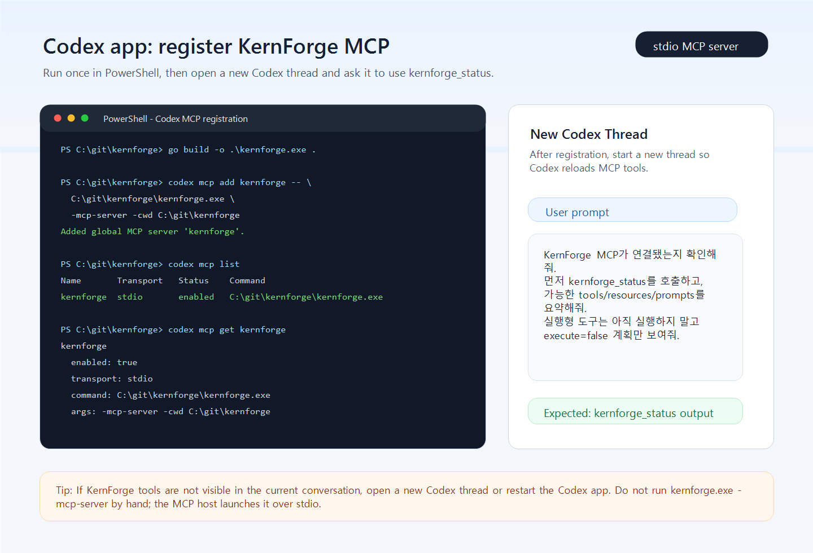

# MCP And Skills

`kernforge` supports local skills and stdio-based MCP servers.

## Workspace Config

Create a workspace config with:

```text
/init config
```

Example `.kernforge/config.json`:

```json
{
  "skill_paths": ["./.kernforge/skills"],
  "enabled_skills": ["checks"],
  "mcp_servers": [
    {
      "name": "example",
      "command": "node",
      "args": ["path/to/server.js"],
      "cwd": ".",
      "disabled": true
    },
    {
      "name": "web-research",
      "command": "node",
      "args": [".kernforge/mcp/web-research-mcp.js"],
      "env": {
        "TAVILY_API_KEY": "",
        "BRAVE_SEARCH_API_KEY": "",
        "SERPAPI_API_KEY": ""
      },
      "cwd": ".",
      "capabilities": ["web_search", "web_fetch"]
    }
  ]
}
```

## Skills

Create a starter skill with:

```text
/init skill checks
```

Expected layout:

```text
.kernforge/
  skills/
    checks/
      SKILL.md
```

Prompt usage:

- Use `$checks` to activate a skill for the current request.
- Use `/skills` to inspect discovered skills.
- Use `/reload` after editing skill files or config.

## MCP

Configured MCP servers are started over stdio and their tools are exposed to the model.

### KernForge As MCP Server

KernForge can also run as a stdio MCP server for Codex app-server style clients:

Detailed Korean install and usage guide:

- [KernForge MCP Server Mode 사용 가이드](./MCP_SERVER_MODE_kor.md)

Fast Codex registration:



```powershell
cd C:\git\kernforge
go build -o .\kernforge.exe ./cmd/kernforge
codex mcp add kernforge -- C:\git\kernforge\kernforge.exe -mcp-server
codex mcp list
codex mcp get kernforge
```

Daemon-backed Codex registration:

```powershell
cd C:\git\kernforge
.\kernforge.exe daemon start
codex mcp add kernforge -- C:\git\kernforge\kernforge.exe -mcp-server -mcp-daemon-proxy
.\kernforge.exe daemon status
```

For Codex, do not pin `cwd` or `-cwd`; Codex starts the MCP process in the active project workspace. If Codex reports a startup timeout, set `startup_timeout_sec` in `C:\Users\<user>\.codex\config.toml`:

```toml
[mcp_servers.kernforge]
command = 'C:\git\kernforge\kernforge.exe'
args = ["-mcp-server"]
startup_timeout_sec = 120
```

For daemon-backed mode, use `args = ["-mcp-server", "-mcp-daemon-proxy"]`. The stdio MCP process stays lightweight while the local `kernforge daemon` keeps workspace state and caches warm.

KernForge server mode accepts both MCP `Content-Length` frames and newline-delimited JSON-RPC frames, then replies with the same framing style the client used. If a timeout persists after setting `startup_timeout_sec`, rebuild `kernforge.exe`; older binaries may only understand one framing style.

KernForge chooses the workspace from MCP initialize roots when the host sends them, otherwise from the MCP process working directory. `kernforge_status` reports both `workspace` and `mcp_workspace_source`; for Codex, `mcp_workspace_source: "fallback"` is normal when the fallback is the active project cwd.

```json
{
  "name": "kernforge",
  "command": "C:/git/kernforge/kernforge.exe",
  "args": ["-mcp-server"],
  "capabilities": ["project_analysis", "security_verification", "evidence", "memory", "fuzzing"]
}
```

Server mode exposes:

- Tools: `kernforge`, `kernforge_fuzz`, `kernforge_guide`, `kernforge_look`, `kernforge_status`, `kernforge_latest_analysis`, `kernforge_read_analysis_doc`, `kernforge_evidence_search`, `kernforge_memory_search`, `kernforge_verification_history`, `kernforge_analysis_context`, `kernforge_artifact_index`, `kernforge_fuzz_targets`, `kernforge_fuzz_func`, `kernforge_fuzz_func_preview`, `kernforge_fuzz_func_build`, `kernforge_fuzz_func_status`, `kernforge_fuzz_artifacts`, `kernforge_fuzz_campaign_status`, `kernforge_fuzz_campaign_run`, `kernforge_verify`, `kernforge_analyze_project`, `kernforge_find_root_cause`
- Resources: `kernforge://status`, `kernforge://analysis/latest`, `kernforge://analysis/context`, `kernforge://analysis/latest/manifest`, `kernforge://analysis/latest/run`, `kernforge://evidence/recent`, `kernforge://memory/recent`, `kernforge://verification/history`, `kernforge://artifacts/index`, `kernforge://fuzz/targets`, `kernforge://fuzz/function-runs/recent`, `kernforge://fuzz/campaign/latest`, generated docs under `kernforge://analysis/latest/docs/<name>`, function fuzz runs under `kernforge://fuzz/function-runs/<id>`, and campaigns under `kernforge://fuzz/campaign/<id>`
- Resource templates: `kernforge://analysis/context/{query}`, `kernforge://analysis/latest/docs/{name}`, `kernforge://memory/search/{query}`, `kernforge://fuzz/function-runs/{id}`, `kernforge://fuzz/campaign/{id}`
- Prompts: `kernforge-security-review`, `kernforge-root-cause`, `kernforge-fuzz-plan`, `kernforge-verify-with-memory`

Analysis and root-cause tools require a configured provider/model in KernForge config or the resumed session. Status, latest-analysis reads, focused analysis context from saved artifacts, evidence/memory/history search, artifact index, guided routing, fuzz target reads, source-level fuzz planning, function fuzz preview/build-only, campaign status, and verification planning can be used without model access.

When the user starts with "KernForge ..." or asks to use KernForge, call the default `kernforge` tool first before shell, `rg`, `git status`, file reads, status, analysis, verify, or fuzz tools. Do not preflight with local commands. When the user only names a function or file, or says "look at / 봐줘", pass that text as `request` and any known `file`. If the response has `stop_after_response=true`, stop immediately: show `ask_user` and `choices`, then wait for the user's answer. Do not call shell, read local files, call `kernforge_status`, or call `kernforge_analysis_context` before the user chooses. Use `kernforge_guide` directly only when the user already stated an intent such as fuzz, verify, analyze, or root-cause.

When the user explicitly says fuzz/fuzzing/퍼징/퍼즈/하네스, call `kernforge_fuzz` first. Its default mode is `source`, so it creates a source-level fuzz plan without compile, native build, or native fuzz execution. Before that tool call, keep narration minimal: say only that KernForge source-level fuzzing will run, and do not say you will check KernForge tool availability, inspect local code, find definitions/callers, discover tests, make fixes, or continue with follow-up work. Avoid Korean preamble phrases such as `KernForge 도구를 확인`, `실제 위치를 찾겠다`, `정의와 호출부를 찾겠다`, `테스트 구조를 보겠다`, or `퍼징 대상만 좁게 건드리겠다`. If the model accidentally calls the generic `kernforge` router with an explicit fuzz request, KernForge routes it to the same source-only path. After summarizing source-level results, naturally recommend the optional native path: `native_preview`, then `build_only`, then runtime fuzzing with explicit user approval.

For `kernforge_fuzz_func`, the default source candidate context is `source_scan=focused`: KernForge reuses a matching saved source candidate or runs a target-scoped source scan before saving the plan. Use `source_scan=off` only when the user wants no candidate linkage, and `source_scan=full` only when a workspace-wide matcher sweep is explicitly useful. When the response includes `source_candidate_id`, `source_matcher_slug`, `source_scan_mode`, `source_scan_run_id`, or `source_scan_summary`, mention the linked candidate only as source-level evidence, not as a confirmed runtime bug.

For structured source candidate workflows, prefer `kernforge_source_scan`, `kernforge_source_candidate_list`, `kernforge_source_candidate_show`, and `kernforge_fuzz_workflow`. These tools return `candidate_id`, `matcher_slug`, `confidence_breakdown`, evidence spans, dataflow/control-flow facts, stale-source state, `next_command`, and `next_tool_call` so the client can continue with candidate-driven fuzzing without parsing terminal prose. Treat `stale=true` as a request to rerun source-scan before presenting the candidate as current.

Expected Codex App source-level fuzz result:


If `kernforge_fuzz` returns `source_only=true` or `stop_after_response=true`, summarize that result and stop. Always report `fuzz_result.meaningful_result`: if it is true, say what the meaningful result was from `fuzz_result.meaningful_results`; if it is false, explicitly say that no meaningful fuzz result was found and include the reason. For any fuzz result kind, when `meaningful_result=true` or `must_report_problem_code_and_trigger_values=true`, the assistant must show the exact `problem_code_location`, the problematic code snippet from `problem_code`, and the triggering values/conditions from `trigger_values`. If KernForge marks any field unavailable, say that explicitly instead of inventing values. When the response includes `Highlighted result labels`, use the Markdown-safe orange/yellow square labels for `Result`, `Top candidate`, `Problem location`, `Trigger conditions KernForge generated`, and `Artifacts`; do not use raw HTML spans. Always include every path from `artifact_paths`: `artifact_dir`, `report_path`, `plan_path`, and `harness_path`; an answer that lists only `artifact_dir` is incomplete. It is appropriate to end with an optional recommendation for native/runtime fuzzing, but do not preface source-only fuzz answers with tool availability checks, local source inspection, test discovery, fix plans, or modification plans, and do not call `kernforge_fuzz_func_preview`, `kernforge_fuzz_func_build`, `kernforge_fuzz_func execute=true`, `kernforge_fuzz_campaign_run`, shell follow-ups, artifact readers, custom harness creation, or ad hoc semantic/fuzz scripts unless the user explicitly asks for that next step. If the user asks to see detailed source-level fuzz artifacts, call `kernforge_fuzz_artifacts` with `id=latest` or the run id and `artifact=overview`, `report`, `plan`, `harness`, or `all`. Do not add a source-code modification or no-modification note unless the user asked for code edits or source files were actually modified.

Useful commands:

- `/mcp`
- `/resources`
- `/resource <server:uri-or-name>`
- `/prompts`
- `/prompt <server:name> {"arg":"value"}`

Prompt usage:

- Use `@mcp:server:resource` to inject a listed MCP resource into the prompt context.
- Remote MCP tools are exposed as `mcp__server__tool`.
- Resource readers are exposed as `mcp__resource__server`.
- Prompt resolvers are exposed as `mcp__prompt__server`.

### Web Research MCP Setup

Use capability tags when you connect a live web-search or browser MCP:

- On startup, Kernforge deploys the bundled web-research MCP to `~/.kernforge/mcp/web-research-mcp.js`.
- If `~/.kernforge/config.json` does not already contain an equivalent web-research MCP entry, Kernforge auto-adds one.
- The bundled source copy lives under `cmd/kernforge/.kernforge/mcp/web-research-mcp.js`; runtime workspaces normally use the deployed copy under `~/.kernforge/mcp`.
- Keep `capabilities` such as `"web_search"` and `"web_fetch"` on the server entry.
- You can provide `TAVILY_API_KEY`, `BRAVE_SEARCH_API_KEY`, or `SERPAPI_API_KEY` either through your shell environment or through `mcp_servers[].env` in config.
- `fetch_url` uses Jina Reader first, then falls back to a direct fetch. Set `WEB_RESEARCH_DISABLE_JINA=1` if you want to skip the reader path.
- Run `/reload` after editing `.kernforge/config.json`.
- Run `/mcp` and confirm the server exposes tools such as `mcp__web_research__search_web` or `mcp__web_research__fetch_url`.
- In PowerShell, a quick session setup looks like:

```powershell
$env:TAVILY_API_KEY = "replace-me"
```

- Test it with a prompt like `Hypervisor-based anti-cheat detection 최신 기법을 조사해`.

When a web-research MCP is available, Kernforge will prefer those tools before local file inspection for latest/current research requests.

## Reloading

Use:

```text
/reload
```

This reloads:

- config from disk
- memory files
- discovered skills
- MCP server connections

