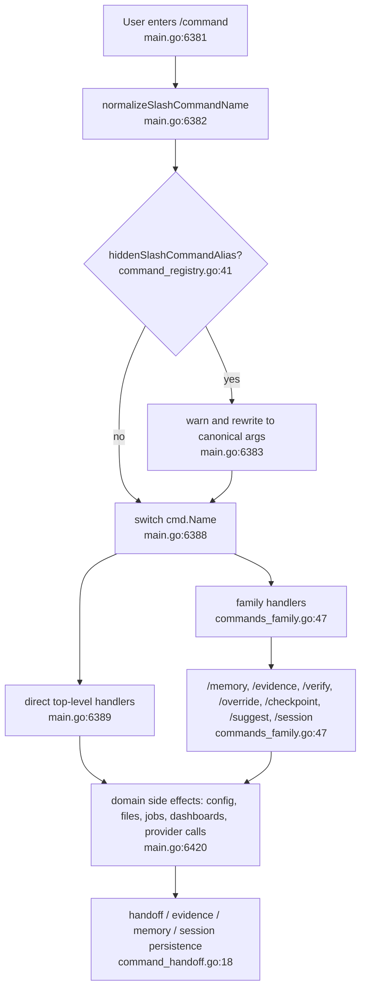
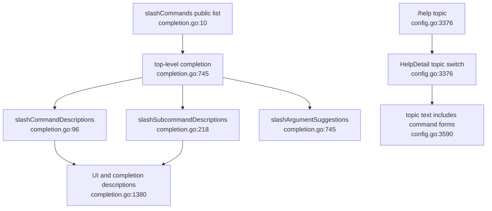
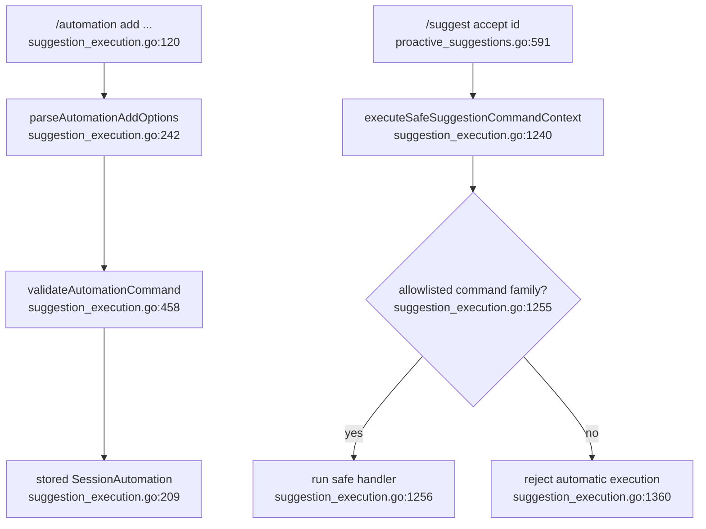
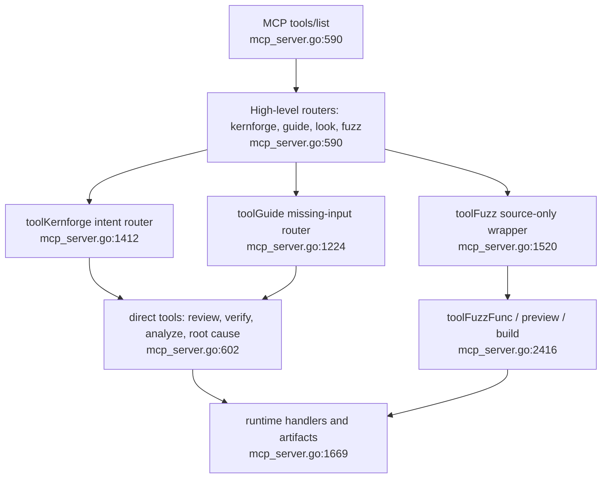

# Command Surface Flowcharts

## CLI Slash Command Dispatch

```mermaid
flowchart TD
    A["User enters /command<br/>main.go:6381"] --> B["normalizeSlashCommandName<br/>main.go:6382"]
    B --> C{"hiddenSlashCommandAlias?<br/>command_registry.go:41"}
    C -->|yes| D["warn and rewrite to canonical args<br/>main.go:6383"]
    C -->|no| E["switch cmd.Name<br/>main.go:6388"]
    D --> E
    E --> F["direct top-level handlers<br/>main.go:6389"]
    E --> G["family handlers<br/>commands_family.go:47"]
    G --> H["/memory, /evidence, /verify, /override, /checkpoint, /suggest, /session<br/>commands_family.go:47"]
    F --> I["domain side effects: config, files, jobs, dashboards, provider calls<br/>main.go:6420"]
    H --> I
    I --> J["handoff / evidence / memory / session persistence<br/>command_handoff.go:18"]
```
## Help And Completion

```mermaid
flowchart TD
    A["slashCommands public list<br/>completion.go:10"] --> B["top-level completion<br/>completion.go:745"]
    B --> C["slashCommandDescriptions<br/>completion.go:96"]
    B --> D["slashSubcommandDescriptions<br/>completion.go:218"]
    B --> E["slashArgumentSuggestions<br/>completion.go:745"]
    F["/help topic<br/>config.go:3376"] --> G["HelpDetail topic switch<br/>config.go:3376"]
    G --> H["topic text includes command forms<br/>config.go:3590"]
    C --> I["UI and completion descriptions<br/>completion.go:1380"]
    D --> I
```

## Suggestion And Automation Execution

```mermaid
flowchart TD
    A["/automation add ...<br/>suggestion_execution.go:120"] --> B["parseAutomationAddOptions<br/>suggestion_execution.go:242"]
    B --> C["validateAutomationCommand<br/>suggestion_execution.go:458"]
    C --> D["stored SessionAutomation<br/>suggestion_execution.go:209"]
    E["/suggest accept id<br/>proactive_suggestions.go:591"] --> F["executeSafeSuggestionCommandContext<br/>suggestion_execution.go:1240"]
    F --> G{"allowlisted command family?<br/>suggestion_execution.go:1255"}
    G -->|yes| H["run safe handler<br/>suggestion_execution.go:1256"]
    G -->|no| I["reject automatic execution<br/>suggestion_execution.go:1360"]
```

## MCP Tool Surface

```mermaid
flowchart TD
    A["MCP tools/list<br/>mcp_server.go:590"] --> B["High-level routers: kernforge, guide, look, fuzz<br/>mcp_server.go:590"]
    B --> C["toolKernforge intent router<br/>mcp_server.go:1412"]
    B --> D["toolGuide missing-input router<br/>mcp_server.go:1224"]
    B --> E["toolFuzz source-only wrapper<br/>mcp_server.go:1520"]
    C --> F["direct tools: review, verify, analyze, root cause<br/>mcp_server.go:602"]
    D --> F
    E --> G["toolFuzzFunc / preview / build<br/>mcp_server.go:2416"]
    F --> H["runtime handlers and artifacts<br/>mcp_server.go:1669"]
    G --> H
```
