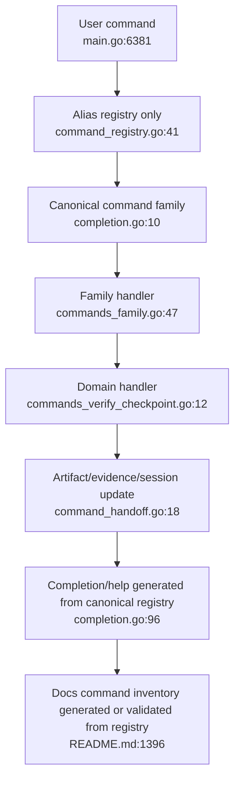

# Proposed Unified Command Architecture

## Recommended Direction

Use one canonical family per operator intent:

- `/review ...` for semantic review
- `/verify ...` for build/test verification and verification tool paths
- `/checkpoint ...` for checkpoint create/list/diff/rollback/auto
- `/memory ...` for persistent memory
- `/evidence ...` for evidence records
- `/model ...` for all provider/model route configuration
- `/session ...` for conversation lifecycle, continuity, jobs, handoff, tasks, and dashboards
- `/hooks ...` for hook status/reload/override policy
- `/analyze ...` for project/performance/root-cause analysis in the long term
- `/fuzz ...` for function fuzzing, campaigns, source scan, and driver POC in the long term

Compatibility aliases should live in one place: `hiddenSlashCommandAliases`. A hidden alias should never also have a direct switch case, public description, or public completion entry.

## Migration Phases

### P0 - Remove Internal Dead Alias Surface

Target component: `hiddenSlashCommandAliases`

Single entry point:
- `cmd/kernforge/command_registry.go:41`

Rewrite:
- Delete direct hidden cases in `handleCommand`.
- Delete hidden alias descriptions and argument completion branches from `completion.go`.
- Preserve alias dispatch tests and deprecation warning behavior.

Acceptable loss:
- None. Hidden aliases still work through the registry.

### P1 - Complete Existing Families

Checkpoint:
- Add `/checkpoint list` and `/checkpoint rollback`.
- Move `/checkpoints` and `/rollback` to hidden aliases.

Model:
- Extend `/model` with scriptable analysis/task-owner route subcommands.
- Move `/set-analysis-models` and `/set-specialist-model` to hidden aliases after parity tests.

Session:
- Expand `/session` from metadata/dashboard into a lifecycle hub.
- Move `/events`, `/continuity`, `/recover`, `/completion-audit`, `/jobs`, `/handoff`, and `/tasks` behind canonical `/session ...` forms, then hide old commands gradually.

### P2 - Shared Helpers And Secondary Consolidation

Dashboards:
- Add a shared dashboard subcommand parser for `dashboard`, `dashboard --html`, and `dashboard-html`.
- Optionally add `/dashboard <family>`.

Hooks:
- Add `/hooks reload` and `/hooks override status|add|clear`.
- Decide whether `/override` remains visible as emergency shorthand or becomes a hidden alias.

MCP:
- Keep direct typed tools.
- Simplify docs around one primary router: `kernforge`.
- Treat `kernforge_guide` and `kernforge_look` as compatibility/internal routing variants unless tool selection quality requires visibility.

### P3 - Large Family Renames

Analysis:
- `/analyze project`
- `/analyze dashboard`
- `/analyze docs refresh`
- `/analyze performance`
- `/analyze root-cause`
- `/analyze root-cause patterns`

Fuzz:
- `/fuzz func`
- `/fuzz campaign`
- `/fuzz source-scan`
- `/fuzz driver-poc`

These should be done only after P0/P1 settles, because docs, MCP mapping, and user muscle memory are broad.

## Unified Flow

