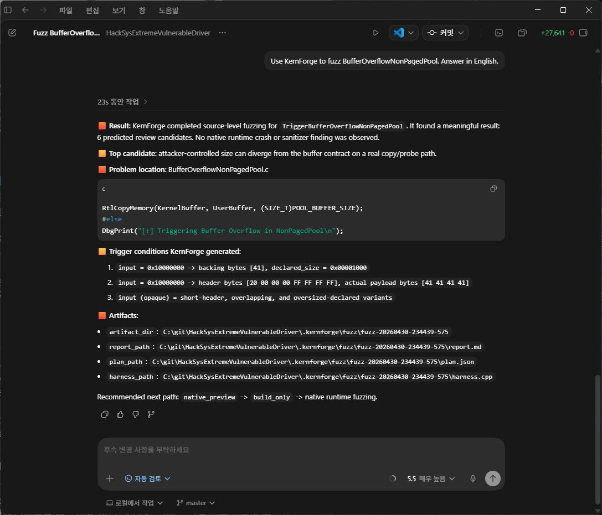

# Kernforge


| 비교 축 | Kernforge | Codex | Claude Code |
|---|---|---|---|
| 가장 잘 맞는 용도 | Windows security, anti-cheat, telemetry, driver 워크플로우, 대형 프로젝트 분석, evidence 기반 검증 | 범용 코딩 에이전트 작업, 로컬 편집 루프, task delegation, automation, PR 중심 workflow | 범용 agentic coding, configurable hooks, subagents, 외부 연동, 팀 정책 workflow |
| 핵심 강점 | 큰 워크스페이스를 재사용 가능한 project intelligence, security docs, fuzz target, verification history, evidence, persistent memory로 바꾼다 | 작업을 맡기면 inspect, edit, test, recover, summarize를 자연스럽게 끝까지 굴린다 | hooks, subagents, MCP식 연동, 조직별 workflow 구성 능력이 강하다 |
| 대화 기억 | conversation event, active state, recent error, recovery brief, suggestion memory, task graph, session dashboard, continuity packet, persistent memory를 저장한다 | thread/workspace awareness와 task continuity가 매우 강하다 | project instruction과 agent 설정을 통한 대화 context 유지가 강하다 |
| 선제 판단 | `SituationSnapshot` 기반 rule/data-driven 판단으로 verification, stale docs, fuzz gap, provider failure, checkpoint/worktree, PR review, automation follow-up을 제안한다 | 구현 중 다음 실용 행동을 고르는 능력이 강하다 | hook, subagent, project convention으로 workflow가 잘 정의됐을 때 강하다 |
| 검증과 증거 | adaptive verification, verification history, evidence store, dashboard, memory promotion, fuzz result gate가 1급 기능이다 | test/command loop는 강하지만 domain evidence modeling은 범용적이다 | tool loop는 강하지만 evidence modeling은 사용자/프로젝트 구성에 의존한다 |
| Windows/security 특화 | IOCTL, ETW, driver, memory scanning, Unreal, telemetry, signing, fuzzing, anti-cheat surface에 깊게 맞춰져 있다 | 기본적으로 범용 coding agent다 | 기본적으로 범용 coding agent다 |
| 자동화 성숙도 | 로컬 MVP: `/automation`, interval schedule due 판단, automation digest/monitor/watch, process-detached daemon, notify artifact와 webhook transport, recurring verification slot, `/jobs`, `/recover`, `/continuity`, `/completion-audit`, issue label/assignee/milestone을 포함한 `/review-pr --github --draft-comments|--post-comments|--resolve-thread|--create-issue` report, `/handoff`, `/session-dashboard-html`, suggestion-to-task graph 구현. cloud job은 남았다 | automation과 PR/task workflow 방향이 성숙하다 | hook과 외부 workflow 연동을 통한 자동화 구성이 강하다 |
| 트레이드오프 | 더 전문적이고 evidence-heavy하지만, 범용 생태계와 desktop/cloud polish는 아직 작다 | 범용 agent 경험은 더 매끄럽지만, 보안/퍼징 전문 지식은 기본 내장 범위가 아니다 | 설정/확장 생태계는 강하지만, Windows security/fuzz workbench 깊이는 기본 내장되어 있지 않다 |

`Kernforge`는 Windows security, anti-cheat engineering, evidence-backed verification을 위한 project intelligence 및 fuzzing workbench입니다. Go로 작성된 터미널 중심 로컬 agent이며, telemetry, driver 워크플로우, memory inspection, Unreal security, 대형 프로젝트 분석에 맞춰져 있습니다.

현재 Kernforge의 가장 큰 강점은 `multi-agent project analysis pipeline`입니다. 큰 워크스페이스를 재사용 가능한 project intelligence로 정리하고, 그 분석 결과를 편집, 검증, evidence, fuzzing, policy 단계까지 그대로 이어갈 수 있습니다.  
특히 `project analysis -> performance lens -> adaptive verification -> evidence store -> persistent memory -> hook policy -> checkpoint/rollback` 흐름을 중심으로, driver, telemetry, memory-scan, Unreal 보안 작업을 더 안전하고 일관되게 진행할 수 있도록 설계되어 있습니다.

현재 제품 방향은 세 축으로 정리됩니다. 첫 번째는 전체 프로젝트 분석 및 문서화입니다. 두 번째는 소스 기반 triage에서 native fuzzing 실행까지 이어지는 퍼징 전문 도구입니다. 세 번째는 사용자가 보고한 증상에서 근본 원인을 좁혀 가는 `/find-root-cause` 기반 진단 루프입니다. README 한국어/영어 문서는 같은 내용을 담고, 각 언어 문서는 같은 기능 범위와 로드맵 방향을 서로 번역한 형태로 유지합니다.

## 소스코드 퍼징

Kernforge의 source-level fuzzing은 코드를 먼저 컴파일하지 않아도 함수 입력 모델, 문제가 되는 코드 위치, 트리거 값, 하네스와 리포트 산출물 경로를 한 번에 정리한다. Codex 앱에서 MCP로 호출하면 아래처럼 `Result`, `Top candidate`, `Problem location`, `Trigger conditions KernForge generated`, `Artifacts`가 먼저 보이도록 설계되어 있다.



이 단계는 native crash나 sanitizer finding을 확정하는 런타임 퍼징이 아니라, 보안 리뷰와 하네스 설계를 빠르게 시작하기 위한 source-level finding이다. 이후 `native_preview -> build_only -> runtime fuzzing` 순서로 올리면 컴파일 가능성, 실제 실행, crash/sanitizer 재현까지 이어갈 수 있다.

## 저장소 구조

GitHub에서 README와 문서를 먼저 읽기 쉽도록 루트에는 문서, 빌드 스크립트, branding asset, release asset을 두고 실제 Go application package는 `cmd/kernforge` 아래에 둔다. 빌드 대상도 이 패키지다.

- `cmd/kernforge`: Kernforge CLI, MCP server, daemon, analysis, fuzzing, verification 구현 및 Go tests
- `cmd/kernforge/.kernforge/mcp`: embedded web-research MCP script source copy
- `cmd/kernforge/root_cause_patterns`: embedded root-cause pattern packs
- `docs/assets`: README와 MCP guide에서 쓰는 스크린샷 및 문서 asset
- `branding`, `buildtools`, `release`: 제품 이미지, Windows resource build, 배포 산출물

## 대표 강점

Kernforge에서 가장 먼저 봐야 할 기능 하나를 꼽으면 `multi-agent project analysis`입니다.

- `/analyze-project [--path <dir>] [--mode map|trace|impact|surface|security|performance] [goal]`는 일회성 요약이 아니라 재사용 가능한 architecture map을 만들고, goal을 생략하면 mode에 맞는 기본 목표를 추론한다.
- 결과물은 knowledge pack, performance lens, structural index, vector-ready analysis set, 운영 문서, HTML 대시보드로 남는다.
- 긴 분석 실행 중에도 총 shard 수, worker slot 수, wave 진행, shard 완료 상태, worker/reviewer 모델 대기 또는 실패 event가 일반 progress 표시 정책을 통해 드러난다.
- 이 분석 자산은 이후 review, edit, verification, policy 흐름까지 계속 재사용된다.
- `/goal`, `-goal`, `-goal-file`은 긴 목표를 끝까지 밀어붙이는 autonomous execution 계층이다. prompt나 markdown 파일의 목표를 영속화하고, 구현, 독립 review, repair, full verification, completion audit, 최종 semantic review, recovery를 목표 완료 또는 구체 blocker 기록까지 반복한다.
- `/find-root-cause [--pattern-pack <path-or-dir>] <problem>`은 증상 프롬프트를 명확성 검사한 뒤 1개부터 최대 8개의 route-limited worker shard, reviewer causality validation, deep verification, deterministic quality gate를 통해 가능한 근본 원인을 좁힌다.
- `/root-cause-patterns`는 Windows service, kernel driver, Unreal, web/backend 같은 프로젝트 타입별로 자주 반복되는 증상/원인 패턴을 내장 지식 pack으로 제공하고, GitHub issue corpus를 수집해 로컬 pattern pack으로 정규화할 수 있게 한다.
- 다음 로드맵의 중심은 새 `/fuzz-campaign` planner를 one-command campaign automation에서 native crash, coverage, evidence, verification gate lifecycle 관리까지 확장하는 것이다.

## 문서

빠른 시작:
- [한국어 빠른 시작](./QUICKSTART_kor.md)
- [English Quickstart](./QUICKSTART.md)

가이드:
- [한국어 기능 활용 가이드](./FEATURE_USAGE_GUIDE_kor.md)
- [한국어 MCP Server Mode 사용 가이드](./MCP_SERVER_MODE_kor.md)
- [English Feature Usage Guide](./FEATURE_USAGE_GUIDE.md)
- [MCP And Skills](./MCP-SKILLS.md)

플레이북:
- [Driver 플레이북](./PLAYBOOK_driver_kor.md)
- [English Driver Playbook](./PLAYBOOK_driver.md)
- [Telemetry 플레이북](./PLAYBOOK_telemetry_kor.md)
- [English Telemetry Playbook](./PLAYBOOK_telemetry.md)
- [Memory-Scan 플레이북](./PLAYBOOK_memory_scan_kor.md)
- [English Memory-Scan Playbook](./PLAYBOOK_memory_scan.md)

설계 문서:
- [한국어 로드맵](./ROADMAP_kor.md)
- [한국어 Fuzzing 및 보안 도구 Gap Analysis](./FUZZING_SECURITY_TOOLS_GAP_ANALYSIS_kor.md)
- [한국어 Hook Engine 스펙](./HOOK_ENGINE_SPEC_kor.md)
- [한국어 Live Investigation Mode 스펙](./LIVE_INVESTIGATION_SPEC_kor.md)
- [한국어 Adversarial Simulation 스펙](./ADVERSARIAL_SIMULATION_SPEC_kor.md)
- [한국어 차세대 Project Analysis 스펙](./PROJECT_ANALYSIS_NEXT_SPEC_kor.md)

가장 추천되는 실사용 흐름은 [한국어 상세 사용 가이드](./FEATURE_USAGE_GUIDE_kor.md)에 정리되어 있습니다. 특히 `analyze-project -> investigate/simulate -> find-root-cause 또는 fuzz-func -> review/edit/plan -> verify -> evidence/memory/hooks` 루프를 그대로 따라가 보면 현재 Kernforge의 핵심 가치를 가장 빨리 체감할 수 있습니다.

## 왜 Kernforge인가

Kernforge는 큰 보안 민감 코드베이스를 먼저 정확히 이해한 다음 변경해야 하는 상황에서 특히 강합니다.

1. driver/signing/symbol/package readiness처럼 실수 비용이 큰 작업
2. telemetry/provider/manifest drift처럼 테스트만으로 놓치기 쉬운 작업
3. memory-scan, Unreal integrity처럼 구조 이해와 운영 가드레일이 동시에 필요한 작업

핵심 차별점은 다음과 같습니다.

1. conductor와 여러 worker/reviewer 패스를 사용해 큰 워크스페이스를 분석할 수 있습니다.
2. 일회성 요약이 아니라 재사용 가능한 knowledge pack과 performance lens를 만듭니다.
3. 그 분석 결과를 review, edit, verification, investigation 흐름으로 그대로 이어갑니다.
4. verification 결과를 evidence와 persistent memory에 구조적으로 남깁니다.
5. 이후 hook policy, push/PR 판단, safety checkpoint까지 연결합니다.

## 현재 구현된 기능

- 재사용 가능한 knowledge pack, performance lens, 운영 문서, HTML 대시보드를 만드는 multi-agent project analysis
- 증상 기반 `/find-root-cause`와 내장 `/root-cause-patterns` 지식 pack
- final answer 직전 acceptance, artifact quality, scenario replay, subagent evidence, test impact, open task, verification, background job 상태를 점검하는 coding harness와 `/completion-audit` readiness artifact
- `TaskState`, `TaskGraph`, node-aware recovery, executor guidance를 갖춘 구조화된 interactive orchestration
- built-in specialist subagent catalog와 editable/read-only specialist routing
- node별 editable ownership/lease, specialist worktree lease, session-level worktree isolation
- 대화형 REPL, `-prompt` 기반 one-shot 실행, scheduler용 `-command` slash command 실행
- `/goal`, `-goal`, `-goal-file` 기반 Codex식 autonomous goal. prompt 또는 markdown 목표를 받아 구현, 자체 리뷰, 검증, completion audit, 최종 semantic review, recovery를 사용자 확인 없이 반복한다.
- `ollama`, `anthropic`, `openai`, `openrouter`, `deepseek`, `openai-compatible`, `lmstudio`, `vllm`, `llama.cpp`, `opencode`, `opencode-go`, `codex-cli`, `openai-codex` provider 지원
- provider/model/base_url/reasoning_effort 단위 model route scheduler로 단일 local 모델이나 같은 route를 공유하는 worker/reviewer 요청을 안전하게 조율
- 파일, 패치, 셸, git 중심 도구 호출
- `git_add`, `git_commit`, `git_push`, `git_create_pr` 같은 전용 git 도구
- 로컬 파일 멘션, 이미지 멘션, MCP 리소스 멘션
- 세션 저장, 재개, 이름 변경, clear, compact, Markdown export
- `/continuity`, `/recover`, `/recover execute-safe`, `/completion-audit`, `/jobs`, local event export, session dashboard를 통한 natural failure recovery
- 프로젝트 메모리 파일과 trust/importance metadata 및 자동 workspace continuity 주입을 갖춘 세션 간 persistent memory
- evidence store, evidence search, evidence dashboard
- 로컬 `SKILL.md` 스킬 탐색과 요청 단위 활성화
- stdio 기반 MCP server의 tool, resource, prompt 연결
- Windows용 별도 텍스트 viewer와 WebView2 기반 diff review/diff viewer
- adaptive verification, 검증 이력 대시보드, checkpoint, rollback
- hook engine, workspace hook rules, evidence-aware push/PR policy
- 별도 reviewer 모델을 사용하는 plan-review 워크플로우
- `.kernforge/features` 아래에 spec/plan/tasks/implementation artifact를 남기는 tracked feature 워크플로우
- disjoint edit lease에 대한 automatic secondary editable worker와 specialist-aware background verification bundle chaining

## 핵심 특징

### Project Analysis

- `/analyze-project [--path <dir>] [--mode map|trace|impact|surface|security|performance] [goal]`로 conductor와 여러 sub-agent를 사용해 프로젝트 문서를 생성
- `--mode`를 생략하면 기본 모드는 `map`
- goal을 생략하면 Kernforge가 `--mode`와 `--path`를 기준으로 실용적인 기본 goal을 만든다.
- `trace`, `impact`, `surface`, `security`, `performance` 같은 non-map 모드는 이전 `map` 실행이 있으면 가장 관련 높은 결과를 baseline architecture map으로 자동 로드한다.
- analysis confirmation 화면은 진행 여부를 묻기 전에 선택된 `baseline_map`을 보여준다.
- provider rate-limit이나 일시적인 worker/reviewer 실패는 전체 analysis run을 중단하지 않고 해당 shard를 저신뢰 섹션으로 낮춰 기록한다.
- local model 실행에서는 shard 제한을 명시하지 않은 경우 provider, 모델 크기, max token, request timeout을 보고 shard 크기를 자동 조절한다. 그래도 최종 provider timeout 또는 5xx/overload 계열 오류로 run이 멈추면 사용자에게 더 작은 shard로 재시도한다고 알리고, `max_lines_per_shard` / `max_files_per_shard`를 줄이고 shard 상한을 올려 한 번 더 실행한다. rate limit은 shard를 줄이면 요청 수가 늘 수 있으므로 이 자동 재실행 대상에서 제외한다.
- worker와 reviewer가 같은 provider/model route를 공유하면 shard concurrency는 model route limit을 따른다. local provider의 기본 route limit은 1이라 직렬 실행되지만, cloud/API route는 강제로 1로 낮추지 않고 설정된 동시성을 유지한다.
- 실행 중에는 shard wave, 완료/실패 shard 수, cache/review 상태, `worker runtime: ...` 또는 `reviewer security_rpc: ...`처럼 analysis stage와 shard 이름이 붙은 model progress line을 보여준다.
- 각 실행은 worker 시작 전에 추론된 intent, effective mode, scope, 필요한 index, provider/runtime feedback, shard contract, 성공 기준을 담은 `analysis_preflight.json`을 남긴다.
- 각 shard는 `type`, `objective`, `required_evidence`, `success_criteria` contract를 갖고, worker report는 source anchor가 붙은 `claims`를 포함한다. reviewer와 synthesis는 직접 사실, 추론, 위험, 미확인 항목을 이 claim contract 기준으로 구분한다.
- worker/reviewer 이후에는 mode별 coverage, claim/evidence support, review approval, deterministic coverage gap을 담은 `mode_scorecard.json`을 생성한다. 의미 있는 빈틈이 있으면 최종 synthesis 전에 제한된 gap-filling shard pass를 한 번 더 실행한다.
- `surface` 모드는 IOCTL, RPC, parser, handle, memory-copy, telemetry decoder, network entry point 같은 노출면을 정식 분석 대상으로 둔다.
- `security` 모드에서는 관련 경로가 있을 때 `driver`, `IOCTL`, `handle`, `memory`, `RPC` surface로 결과를 분해해서 본다.
- 변경되지 않은 shard는 가능한 경우 재사용하는 incremental 분석
- goal에 특정 디렉토리 힌트가 있으면 해당 하위 영역으로 분석 범위를 좁힐 수 있다. 범위를 명시적으로 고정하고 실행 전에 검증하고 싶으면 `--path <dir>`를 사용한다.
- interactive 실행에서는 hidden directory나 external-looking directory를 보여 주고 이번 분석에서 제외할지 확인할 수 있다.
- semantic fingerprint 기반 invalidation으로 file hash만으로 놓치기 쉬운 구조 변화까지 다시 분석
- semantic invalidation은 network, security, build/startup, asset/config, runtime-flow contract 변화처럼 더 구체적인 reason/class로 정제되어 incremental rerun에서 왜 재분석됐는지 설명한다.
- `.uproject`, `.uplugin`, `.Build.cs`, `.Target.cs`, `compile_commands.json`를 build alignment에 반영해 재사용 가능한 build context를 만든다.
- `structural_index_v2`는 이제 file 중심 요약을 넘어 symbol anchor, build ownership edge, function-level call edge, overlay edge를 함께 담는다.
- `trace`, `impact`, `security` retrieval은 graph neighborhood를 확장하고 `build_context_v2`, `path_v2` 근거를 함께 남긴다.
- Unreal project/module/target/type/network/asset/system/config 신호를 구조화해 대형 UE 프로젝트 대응
- semantic shard planner와 semantic-aware worker/reviewer prompt로 startup, network, UI, GAS, asset/config, integrity 영역을 우선 분석
- knowledge pack 외에도 structural index, `structural_index_v2`, Unreal semantic graph, vector corpus, vector ingestion export를 함께 생성
- `architecture_facts.json`도 생성한다. 이 파일은 top-level directory, domain hint, source anchor, registration/dispatch flow, boundary fact, invariant를 담는 deterministic fact pack이며 cached architecture Q&A의 기준 데이터로 사용된다.
- generated docs와 `dashboard.html`을 함께 생성해 최신 프로젝트 지식 베이스를 모듈/기능 구조 맵과 다크 테마 정적 document portal로 확인한다. portal은 최종 리포트와 generated docs 본문 검색, source anchor, graph-linked stale section diff, trust-boundary/attack-flow view, evidence/memory drilldown, docs-backed vector corpus reuse를 제공한다.
- dashboard에는 inline Markdown viewer와 full-window reader mode가 있어 `FINAL_REPORT.md`처럼 긴 산출물을 dashboard 안에서 크게 읽을 수 있다.
- "영어로 리포트를 작성해" 같은 명시적 언어 요청은 분석 worker와 synthesis prompt의 감지 언어보다 우선하며, 실행 중 progress/status truncation은 UTF-8 안전하게 처리된다.
- 최종 handoff 직전에는 눈에 띄는 `Analysis artifacts:` 블록을 출력해 report, JSON, dashboard, docs, manifest 경로를 다시 보여준다. 긴 실행 로그를 위로 한참 스크롤하지 않아도 산출물을 바로 찾을 수 있다.
- 분석 후에는 `Analysis handoff`를 출력해서 생성 문서가 지원하는 다음 단계에 따라 `/analyze-dashboard`, `/fuzz-campaign run`, 상위 `/fuzz-func ...` drilldown, `/verify` 중 필요한 명령을 안내한다.
- source anchor parser는 template out-of-line method, operator, `requires`, `decltype(auto)`, API macro가 낀 scope, friend function 같은 modern C++ 패턴까지 추적한다.
- `security` 모드 최종 문서에는 privileged path를 따로 읽기 쉽도록 `Security Surface Decomposition` 섹션이 추가된다.
- 메인 채팅 모델과 별도로 worker/reviewer 모델을 지정 가능
- `.kernforge/analysis` 아래에 architecture knowledge pack과 performance lens 출력
- `.kernforge/analysis/latest`는 persistence 때마다 교체되므로 이전 run의 오래된 파일이 cached retrieval에 섞이지 않는다.
- `/analyze-dashboard [latest|path]`로 최신 또는 특정 analysis document portal 열기
- `/docs-refresh`로 최신 분석 run에서 운영 문서, 대시보드, docs-backed vector corpus를 deterministic하게 재생성
- `/analyze-performance [focus]`로 최신 분석 산출물을 기준으로 병목과 hot path 분석
- performance report는 마지막에 `Performance handoff`를 출력해 `/analyze-dashboard`, `/verify`, `/simulate stealth-surface`, 구체 `/fuzz-func ...` hotspot drilldown으로 이어준다.

### Root-Cause Investigation

- `/find-root-cause <problem description>`은 파티원 제한 초과, `sc stop` 미종료, 문서 artifact 누락처럼 사용자가 자연어로 설명한 증상을 받아 근본 원인 후보를 찾는다.
- 프롬프트가 너무 짧거나 영향을 받는 컴포넌트, trigger/repro, observed failure, expected invariant가 불명확하면 agent를 시작하지 않고 부족한 부분과 더 정확한 `/find-root-cause ...` 예시를 출력한다.
- borderline prompt는 source hint와 모델 기반 clarity check를 거쳐 한국어 자연어 증상이 키워드 부족만으로 거절되지 않게 한다.
- workspace를 스캔해 증상 키워드, source path, indexed symbol, 내장 pattern prior를 결합하고 코드 크기와 후보 수에 따라 1개부터 8개 worker shard로 나눈다. 동시 model call 수는 `model_routes` 설정을 따른다.
- worker는 각 코드 영역에서 입력 파라미터, decoded payload, DB/config 값, cache state, counter, id, enum, nullable reference, lifecycle state가 코드가 기대한 범위를 벗어나는 경우를 fuzzing처럼 검토한다.
- worker 후보는 `trigger -> invalid_state -> state_transition -> missing_guard -> user_visible_symptom` causal chain을 갖춰야 한다.
- reviewer는 worker가 제시한 문제가 사용자가 요청한 증상으로 실제 이어질 수 있는지 검증하고, 증거가 부족하면 추가 focused shard를 요구한다.
- deterministic quality gate는 causal stage, evidence file, concrete state signal, valid probe, symptom overlap이 부족한 후보를 downgrade 또는 reject한다.
- reviewer-approved 후보는 symbol-aware focused excerpt로 deep verification을 한 번 더 거치고, 최종 문서는 root cause 후보, confidence breakdown, evidence file/function, instrumentation, verification probe, disproof condition을 정리한다.
- 산출물은 일반 analysis artifact와 함께 `.kernforge/analysis/<run-id>/` 및 `latest` 아래에 남고, `root_cause_audit.md/json` 형태의 audit trail도 보존된다.
- `/root-cause-patterns list|match|github-search|normalize|validate`는 내장 pattern pack 확인, 현재 workspace와 증상 매칭, GitHub issue 기반 provisional pack 생성을 지원한다. pattern pack은 search prior일 뿐이며, 최종 판단은 항상 현재 소스 증거와 reviewer causality validation을 요구한다.

### 보안 검증과 정책 루프

- driver, telemetry, Unreal, memory-scan 중심 security-aware verification
- verification history와 verification dashboard
- `/verify`는 마지막에 `Verification handoff`를 출력한다. 실패 시 repair/retry dashboard로, 성공 시 checkpoint와 tracked feature 상태에 맞는 status/close로 안내하며 native fuzz finding도 targeted planner step으로 끌어온다.
- `/recover execute-safe`는 `/verify`가 실패 report를 남기거나 `/completion-audit`가 `ready=false` artifact를 남기면 slash command가 실행됐다는 이유만으로 완료 처리하지 않고 recovery action을 실패로 기록한다.
- safe recovery shell replay는 좁은 Go/Git verification/status 명령으로 제한하고 shell chaining/redirection, 외부 test executor, vet tool, diff/profile 파일 출력 플래그 같은 고위험 옵션을 차단한다.
- verification 결과의 evidence store 누적
- evidence 검색과 evidence dashboard
- `/investigate`와 `/simulate`는 snapshot, risk simulation, `/verify`, evidence dashboard로 이어지는 handoff를 출력해 사용자가 분석 루프 순서를 외우지 않아도 된다.
- evidence와 memory 화면은 조치가 필요한 record를 기준으로 `/verify`, source dashboard, `/mem-confirm`, `/mem-promote`, dashboard review로 되돌아가는 handoff를 출력한다.
- checkpoint, tracked feature, isolated worktree, specialist assignment도 diff review, implementation, cleanup, preservation, fuzz verification gate를 위한 짧은 후속 안내를 제공한다.
- `/set-auto-verify [on|off]` 기반 automatic verification 런타임 토글
- `/detect-verification-tools`, `/set-*-path` 기반 Windows verification tool 경로 탐지와 override
- recent failed evidence를 이용한 hook 기반 push/PR 경고, 확인, 차단
- 반복 실패 상황에서 자동 safety checkpoint 생성 가능

### Autonomous Goals

- `/goal <objective>` 또는 `/goal start <objective>`는 persistent goal을 만들고 즉시 autonomous loop를 시작한다.
- `/goal start @GOAL.md`와 `kernforge -goal-file GOAL.md`는 markdown 파일에서 목표를 읽는다.
- `kernforge -goal "..."`는 REPL에 들어가지 않고 같은 루프를 실행하며, `-goal-max-iterations`, `-goal-time-budget`, `-goal-token-budget`, `-goal-until-complete`, `-goal-rollback-on-regression` 제어도 지원한다.
- 각 iteration은 agent에게 실제 코드 확인, 개발, 수정, 자체 리뷰, 최종 semantic goal review, 버그 수정을 사용자 확인 없이 수행하게 한다.
- goal runtime은 각 목표를 acceptance contract, task graph, 독립 review verdict, progress ledger, command history, checkpoint 저장소가 설정된 경우 iteration별 checkpoint에 연결한다.
- goal reviewer는 implementation reply, 가능한 경우 checkpoint diff, git status/diff context, 제한된 untracked 파일 excerpt 같은 실제 workspace 증거를 함께 받는다. review가 `NEEDS_REVISION`이면 repair prompt는 구조화된 reviewer issue와 같은 구현 context를 보존해서 worker가 모호한 요약이 아니라 실제 지적 사항을 기준으로 수정할 수 있게 한다.
- 그 다음 Kernforge가 `/verify --full`, `/completion-audit`, 최종 semantic review, 필요 시 `/recover execute-safe`를 실행한 뒤 다음 iteration으로 넘어간다.
- completion audit이 ready이고 최종 semantic review가 승인하거나, 목표가 cancel되거나, provider failure/token/time/iteration cap/반복 failure signature/no-progress loop 같은 회복 불가능 blocker가 기록될 때만 루프가 멈춘다.
- 목표 상태와 이력은 `.kernforge/goals/latest.md`, `.kernforge/goals/latest.json` 및 goal별 사본으로 남는다.
- `--time-budget 10m`, `--token-budget N`, `--until-complete`, `--rollback-on-regression`, `--no-rollback`으로 autonomous stop/recovery 정책을 조정할 수 있다.
- `/goal status`, `/goal audit`, `/goal complete`, `/goal run`, `/goal cancel`로 active goal을 확인, 재감사, 명시적 완료, 재개, 중단할 수 있다.

### 소스 레벨 Function Fuzzing

- `/fuzz-func <function-name>`, `/fuzz-func <function-name> --file <path>`, `/fuzz-func @<path>`로 함수 단위 또는 파일 단위 source-level fuzzing 시작
- `@<path>` 또는 `--file <path>`만 주면 시작 파일과 실제 호출 흐름을 기준으로 대표 루트와 입력 지향 함수 후보를 자동 선택
- `analyze-project`나 `structural_index_v2`가 없어도 워크스페이스 스캔과 on-demand semantic index 복원으로 바로 계획 생성
- 기본 동작은 네이티브 실행보다 AI source-only fuzzing이며, 공격자 입력 상태, 구체 입력 예시, 비교식, 최소 반례, 분기 차이, 후속 호출 체인까지 소스에서 추론
- 기본적으로 `/fuzz-func`는 매칭되는 `/source-scan` 후보를 재사용하고, 없으면 target과 reachable file만 focused source-scan으로 훑은 뒤 plan에 연결한다. candidate에는 function-window evidence span, 파일/심볼 fingerprint, confidence breakdown, dataflow/control-flow fact, stale-source 상태가 함께 저장된다.
- 먼저 `/source-scan run`으로 source candidate를 저장한 뒤, 특정 후보를 명시적으로 이어가고 싶으면 `/fuzz-func --from-candidate <candidate-id>`를 사용한다. built-in matcher에는 Windows kernel double-fetch, IOCTL output infoleak, WDF buffer size drift, integer allocation overflow, pool/refcount lifetime 신호가 포함된다.
- `/create-driver-poc <driver-name> [--type objectfilter|minifilter|registryfilter|wfpcallout]`으로 x64 전용 C++20 MSVC/WDK POC 드라이버 솔루션을 생성한다. `--type`을 생략하면 기존 SCM 설치/시작, device open, IOCTL ping, unload/delete 기본 POC를 생성한다. typed template은 object manager 프로세스/쓰레드 핸들 access stripping, filesystem minifilter open/rename/delete 유저 모드 판단 경로, registry create/open/set/delete/rename callback 차단, WFP outbound callout 차단 계약을 생성한다.
- 고위험 finding은 위험도 점수표, 먼저 볼 소스 위치, 시작 파일에서 거기까지의 파일 확장 경로, 대표 루트에서 이어지는 호출 경로를 함께 보여준다.
- `compile_commands.json`이나 build context가 있으면 후속 네이티브 fuzzing 품질이 올라가고, 없으면 왜 막히는지 먼저 설명한 뒤 진행 여부를 묻는다.
- 결과 산출물은 `.kernforge/fuzz/<run-id>/` 아래의 `report.md`, `harness.cpp`, `plan.json` 등에 저장된다.
- `/fuzz-func status|show|list|continue|language`로 최근 분석 결과, 보류된 실행, 출력 언어를 관리할 수 있다.
- `/fuzz-func`가 source-only scenario를 만들면 Kernforge가 campaign handoff를 출력해서 사용자가 campaign 단계를 외우지 않고 `/fuzz-campaign run` 하나를 다음 명령으로 볼 수 있다.
- `/fuzz-campaign new <name>`으로 `.kernforge/fuzz/<campaign-id>/` 아래 campaign manifest와 `corpus`, `crashes`, `coverage`, `reports`, `logs` 디렉터리를 만든다.
- analysis docs가 있으면 campaign은 최신 생성 `FUZZ_TARGETS.md` catalog에서 초기 target 목록을 seed로 가져온다.
- `/fuzz-campaign`으로 Kernforge가 추천하는 다음 단계를 보고, `/fuzz-campaign run`으로 campaign 생성, attach, source-only seed artifact 승격, dedup된 finding lifecycle과 coverage gap 갱신, run output 또는 campaign coverage directory의 libFuzzer log, llvm-cov text, LCOV, JSON coverage summary 수집, sanitizer report, Windows crash dump, Application Verifier, Driver Verifier artifact, native run report/evidence 기록, 다음 `FUZZ_TARGETS.md` ranking refresh, `/verify`와 tracked feature gate 연결을 자동 처리한다.
- 자동완성은 `/fuzz-func ` 단계에서는 함수명/파일 사용 힌트를 보여주고, `@`를 입력하기 시작하면 실제 workspace 파일 후보로 전환된다.

### 편집 워크플로우

- 파일 쓰기 전 WebView2 diff review
- selection-aware edit preview
- 편집 후 자동 verification
- final answer 직전 coding harness와 `/completion-audit`가 acceptance contract, 실제 변경 path, artifact 생성 여부, artifact 내용 품질, scenario replay 상태, subagent/reviewer 근거, test impact, open task, verification, background job 상태를 검토한다.
- 요청한 문서나 보고서 artifact가 placeholder/TODO이거나 핵심 주제를 전혀 담지 않으면 artifact quality blocker로 최종 답변을 막는다.
- 사용자가 trigger/expected/observed가 있는 bug scenario를 준 경우, 코드 변경 후 replay/verification 결과 또는 "실행하지 못했다"는 명시적 disclosure 없이 해결을 주장하면 scenario replay blocker가 걸린다.
- root-cause 답변에서 worker evidence가 사용자 증상으로 이어지는 causal bridge를 제공하지 못하거나 reviewer issue를 숨기면 subagent orchestration blocker가 걸린다.
- verification 실패가 발생하면 failure repair harness가 첫 의미 있는 실패 줄, 반복 횟수, 좁은 재실행 명령, 다음 수리 단계를 active context로 유지한다.
- tool 실행 사이에 사용자가 같은 target file을 바꾼 경우 user-change isolation이 overwrite를 막고 fresh read/merge-aware edit을 요구한다.
- 큰 파일 편집 루프에서 `read_file`는 변경되지 않은 동일 범위, 포함되는 하위 범위, 부분 겹침 범위를 재사용해서 불필요한 재읽기를 줄인다.
- 최근 `read_file` 문맥과 겹치거나 가까운 `grep` 결과에는 `[cached-nearby:inside]`, `[cached-nearby:N]` 힌트가 붙어 다음 읽기 범위를 더 좁게 잡도록 돕는다.
- 같은 파일에 대한 반복 `read_file` 턴은 캐시 기반 경고를 먼저 주고, 그래도 진전이 없을 때만 강한 반복 호출 중단으로 넘어간다.
- `Allow write?`에서 `a`를 누르면 현재 세션 동안만 write auto-approval이 켜진다.
- `Open diff preview?`에서 `a`를 누르면 현재 수정과 이후 diff preview를 세션 동안 자동 승인
- `git_add`, `git_commit`, `git_push`, `git_create_pr` 같은 git 변경 도구는 별도의 `Allow git?` 세션 승인 경로를 사용한다.
- git 변경 도구는 일반 review/edit 턴이 아니라, 사용자가 명시적으로 git 작업을 요청한 경우에만 쓰는 것이 기본 동작이다.
- 한 요청의 첫 편집 전에 자동 checkpoint 생성
- 수동 checkpoint, checkpoint diff, rollback
- `/open` 중심 selection-first 리뷰/수정 흐름
- 일반 개발에서는 `implementation-owner`가 기본 editable specialist로 붙고, 필요할 때만 `driver-build-fixer`, `telemetry-analyst`, `unreal-integrity-reviewer`, `memory-inspection-reviewer` 같은 도메인 specialist가 task-graph node를 소유해 edit scope를 더 좁힌다.
- `apply_patch`, `write_file`, `replace_in_file`, scoped shell write는 node ownership/lease를 따라가며 배정된 specialist worktree로 라우팅된다.
- `/specialists assign <node-id> <specialist> [glob,glob2]`로 자동 배정 대신 특정 editable specialist와 ownership을 수동 고정할 수 있다.
- `/set-specialist-model <specialist> <provider> [model]`로 이 workspace에서 특정 specialist가 쓸 LLM을 고정하고, `/set-specialist-model clear <specialist|all>`로 override를 지울 수 있다.
- lease가 겹치지 않는 secondary edit node는 automatic editable worker가 추가 patch를 만들 수 있고, lease가 겹치면 충돌 대신 defer된다.
- parallel specialist edit가 verification을 다시 시작하면 같은 owner나 같은 lease의 오래된 background verification bundle은 자동 supersede되고, verification-like bundle이 완료되면 owning node도 함께 닫힌다.

### Tracked Feature Workflow

- `/new-feature <task>`는 tracked feature workspace를 만들고 `spec.md`, `plan.md`, `tasks.md`를 생성한다.
- feature artifact는 `.kernforge/features/<id>` 아래에 저장되어 여러 세션에 걸친 작업을 이어가기 쉽다.
- `/new-feature status|plan|implement|close [id]`로 active feature 상태 확인, 재계획, 실행, 종료를 분리해서 다루며 native fuzz 결과가 있으면 status에서 gate로 보여준다.
- `/do-plan-review <task>`는 여전히 one-shot 계획 검토 후 즉시 실행하는 흐름에 더 적합하다.

### 입력과 프롬프트

- 대화형 채팅 REPL
- `-prompt` 기반 단발 실행
- `-image`, `-i`, `@path/to/image.png` 이미지 첨부
- `@main.go` 같은 파일 멘션
- `@main.go:120-150` 같은 라인 범위 멘션
- `@mcp:docs:getting-started` 같은 MCP 리소스 멘션
- 줄 끝에 `\`를 붙여 멀티라인 입력
- 파일을 명시하지 않았을 때 자동 코드 scouting
- 최근 `analyze-project` 결과를 cached architecture context로 재사용해서 큰 코드 영역 재탐색을 줄일 수 있다.
- 깊은 프로젝트 구조 질문은 generated docs, `architecture_facts.json`, current-source probe를 합친 Project structure answer pack을 우선 사용한다. 답변은 deterministic fact와 대조해 모순이 없을 때만 tool 없이 진행한다.
- cached analysis만으로 답이 충분하면 추가 tool 호출 없이 바로 응답할 수 있다.
- `read_file`가 cached NOTE를 반환하면 Kernforge는 해당 줄을 이미 본 문맥으로 간주해 같은 큰 범위를 다시 읽는 흐름을 줄인다.
- `grep`의 `cached-nearby` 힌트는 아직 읽지 않은 인접 줄만 좁게 다시 읽도록 유도해서 큰 파일 재탐색 비용을 낮춘다.
- 분석, 설명, 진단, 문서화 요청은 기본적으로 read-only investigation 모드로 처리된다.
- 명시적으로 수정까지 요청한 프롬프트는 tool-driven edit 흐름을 유지하고, Kernforge는 모델이 패치를 사용자에게 되돌리려 하면 한 번 더 수정 도구 사용을 유도한다.

### 사용성

- 명령, 경로, 멘션, MCP 대상, 고정 인자, `/provider status|anthropic|openai|openrouter|deepseek|opencode|opencode-go|ollama|codex-cli|openai-codex|lmstudio|vllm|llama.cpp` 같은 provider 하위 명령, analyze-project mode, compact fuzz campaign action, `/create-driver-poc <driver-name>`, `/find-root-cause`, `/root-cause-patterns list|match|github-search|normalize|validate`, `/resume`, `/mem-show`, `/evidence-show`, `/investigate show`, `/simulate show`, `/fuzz-campaign run|show`, `/new-feature status|plan|implement|close`, `/jobs status|check|bundle|cancel|cancel-bundle`, `/specialists status|assign|cleanup`, `/worktree status|list|create|enter|attach|leave|cleanup` 같은 저장된 id와 하위 명령까지 `Tab` 완성
- command/subcommand 자동완성 메뉴에 각 후보 설명을 같이 보여줘서 이름만 나열되지 않게 했다.
- 현재 입력 취소를 위한 `Esc`
- 진행 중 요청 취소를 위한 `Esc`
- 메인 프롬프트에서 빈 입력 상태로 `Enter`를 눌러도 빈 턴을 만들지 않고 무시한다.
- REPL은 compact branded banner, subtle turn divider, grouped status/config section, assistant/tool activity stream 분리로 더 촘촘한 터미널 UX를 사용한다.
- assistant streaming 출력은 선행 blank chunk를 무시하고, progress/info 출력 전 경계를 정리하며, 반복 follow-on preamble 사이에 줄바꿈을 넣어 더 읽기 쉽게 출력된다.
- `이제 ... 확인하겠습니다`, `먼저 ... 수정하겠습니다` 같은 짧은 tool 전 narration은 가능한 한 footer형 진행 상태로 흡수해서 불필요한 assistant block이 늘어나지 않게 했다.
- 기본 대기 문구는 thinking prefix와 중복되지 않게 정리해서 같은 의미를 두 번 보여주지 않는다.
- thinking elapsed 표시는 phase 전환마다 다시 기준 시간을 잡고, 비정상적으로 오래 남은 stale timer 값은 2시간 표시로 clamp한다.
- 반복 blank streamed chunk는 빈 줄 대신 compact working 상태로 바꿔 보여준다.
- `progress_display`가 진행 표시 방식을 제어하며, REPL에서는 `/progress-display auto|compact|stream`으로 바로 바꿀 수 있다. `auto`는 중요한 tool/model/route와 project analysis 진행 event를 transcript ledger로 남기고, `compact`는 footer 중심으로 조용하게 보여주며, `stream`은 모든 progress update를 본문에 지속 기록한다.
- provider, tool, command 실패는 `.kernforge/logs/errors.jsonl` capped JSONL에도 함께 기록된다. Kernforge는 이 파일을 100MB 이하로 유지하므로 UI가 지나간 뒤에도 retry-only provider 실패 원인을 추적할 수 있다.
- OpenAI-compatible 및 OpenAI Codex streaming provider는 tool-call 구성 event를 노출해서 모델이 어떤 tool을 준비 중이고 언제 인자가 완성됐는지 REPL에서 볼 수 있다.
- progress event만 켜진 모델 stream도 일반 assistant stream과 같은 incomplete-stream fallback을 사용한다. OpenAI-compatible streamed response가 비어 있거나 불완전하면, progress event가 켜져 있다는 이유만으로 다시 streaming 경로에 들어가지 않고 non-stream retry로 전환한다.
- `auto` 모드에서는 고빈도 shell output과 heartbeat는 transient footer에 두고, tool start/result/retry 같은 durable event는 본문에 남긴다.
- 취소 확인, diff preview 확인, write 승인, verification 복구 같은 확인 프롬프트도 같은 footer 슬롯을 잠시 점유해서 화면 맨 아래에 고정된 것처럼 보이게 했다.
- 완료 요약, output 경로, warning, 설정 변경처럼 나중에 다시 봐야 하는 결과는 본문 transcript에 남기고, 일시적인 진행 상황은 `progress_display` 정책에 따라 footer 또는 progress ledger로 흘린다.
- 문장 중간에서 잘린 최종 답변은 한 번 continuation 재시도를 걸고 합쳐서 출력한 뒤 프롬프트로 복귀한다.
- Windows 콘솔에서 짧게 누른 `Esc`도 안정적으로 요청 취소
- 요청 취소 직후 다음 프롬프트가 연속 `Esc` 입력으로 자동 취소되지 않도록 안정화
- Windows 콘솔의 `Up`, `Down` 입력 히스토리
- prompt 조립 시 긴 summary를 잘라 넣고, skill/MCP catalog는 실제로 필요한 요청에서만 크게 싣는다.
- auto-scout는 위치 찾기, 정의 찾기, 참조 찾기 성격의 질문에 더 집중하고 턴당 문맥 투입량도 줄였다.

### 지속성

- `/resume` 기반 세션 재개
- 세션 이름 변경과 대화 Markdown export
- citation id, trust, importance가 붙는 persistent memory
- verification category, tag, artifact, failure 기반 memory 검색
- `KERNFORGE.md`, `.kernforge/KERNFORGE.md` 기반 프로젝트 가이드 로딩
- 시스템 locale 기반 자동 언어 지시

### 확장성

- 로컬 `SKILL.md` 스킬
- MCP tool
- MCP resource
- MCP prompt

## 빠른 시작

### 빌드

```powershell
go build -o kernforge.exe ./cmd/kernforge
```

### WebView2 Runtime

Windows diff review와 read-only diff viewer는 WebView2를 사용합니다.

권장 배포 방식:

1. `Evergreen Bootstrapper`
   일반적인 온라인 설치에 가장 무난합니다.
2. `Evergreen Standalone Installer`
   오프라인 또는 제한된 환경에 더 적합합니다.
3. `Fixed Version Runtime`
   렌더링 엔진 버전을 반드시 고정해야 할 때만 권장합니다.

Kernforge 기준 실무 권장안:

1. 설치 프로그램에 `Evergreen Bootstrapper`를 포함하거나 다운로드 경로를 둡니다.
2. Kernforge 실행 전에 WebView2 Runtime 존재 여부를 확인합니다.
3. 없으면 먼저 설치합니다.
4. 그래도 WebView2 초기화가 실패하면 workflow에 따라 브라우저 기반 preview 또는 터미널 diff 출력으로 fallback합니다.

참고:

- [Microsoft WebView2 배포 가이드](https://learn.microsoft.com/en-us/microsoft-edge/webview2/concepts/distribution)
- [WebView2 Runtime 다운로드](https://developer.microsoft.com/en-us/microsoft-edge/webview2/)

### 실행

```powershell
.\kernforge.exe
```

아직 provider/model이 설정되지 않았다면 Kernforge는 다음 순서로 초기 설정을 도와줍니다.

1. 로컬 Ollama 서버를 탐지합니다.
2. 발견되면 바로 연결할지 묻습니다.
3. 아니면 provider 선택 과정을 진행합니다.
4. model, API key, base URL을 입력받습니다.
5. 다음 실행부터 재사용할 수 있도록 저장합니다.

### One-Shot 실행

```powershell
.\kernforge.exe -prompt "이 프로젝트 구조를 설명해줘"
```

이미지 1장 첨부:

```powershell
.\kernforge.exe -prompt "이 스크린샷의 오류 원인을 설명해줘" -image .\screenshot.png
```

이미지 여러 장 첨부:

```powershell
.\kernforge.exe -prompt "이 두 스크린샷 차이를 비교해줘" -image .\before.png,.\after.png
```

### Provider를 지정해서 실행

Anthropic:

```powershell
$env:ANTHROPIC_API_KEY = "your_key"
.\kernforge.exe -provider anthropic -model claude-sonnet-4
```

OpenAI:

```powershell
$env:OPENAI_API_KEY = "your_key"
.\kernforge.exe -provider openai -model gpt-4.1
```

OpenRouter:

```powershell
$env:OPENROUTER_API_KEY = "your_key"
.\kernforge.exe -provider openrouter -model openrouter/auto
```

DeepSeek:

```powershell
$env:DEEPSEEK_API_KEY = "your_key"
.\kernforge.exe -provider deepseek -model deepseek-v4-pro
```

Ollama:

```powershell
.\kernforge.exe -provider ollama -base-url http://localhost:11434 -model qwen3.5:14b
```

OpenAI-compatible:

```powershell
$env:OPENAI_API_KEY = "your_key"
.\kernforge.exe -provider openai-compatible -base-url http://localhost:8000/v1 -model my-model
```

OpenCode Zen:

```powershell
$env:OPENCODE_API_KEY = "your_key"
.\kernforge.exe -provider opencode -model opencode/gpt-5.5
```

OpenCode Go:

```powershell
$env:OPENCODE_GO_API_KEY = "your_key"
.\kernforge.exe -provider opencode-go -model opencode-go/deepseek-v4-pro
```

Codex CLI:

```powershell
.\kernforge.exe -provider codex-cli -model gpt-5.5-pro
```

대화형 REPL 안에서는 `/provider status`로 현재 provider, 정규화된 `base_url`, API key 설정 여부, provider별 budget visibility를 바로 확인할 수 있습니다.

LM Studio:

```powershell
.\kernforge.exe -provider lmstudio -model local-model-id
```

vLLM:

```powershell
.\kernforge.exe -provider vllm -model local-model-id
```

llama.cpp:

```powershell
.\kernforge.exe -provider llama.cpp -model local-model-id
```

### Windows Security Workflow 예시

Driver 변경을 안전하게 밀어붙이는 가장 기본 흐름:

1. driver 관련 파일을 수정합니다.
2. `/verify`를 실행해 signing, symbol, package, verifier readiness 중심 verification plan을 확인합니다.
3. `/evidence-dashboard` 또는 `/evidence-search category:driver`로 최근 failed evidence를 확인합니다.
4. 필요하면 `/mem-search category:driver`로 이전 세션 맥락까지 확인합니다.
5. push 또는 PR 생성 시 hook policy가 최근 evidence를 다시 보고 경고, 확인, 차단, checkpoint 생성을 수행합니다.

더 공격자 관점까지 포함한 권장 흐름:

1. `/investigate start driver-visibility guard.sys`
2. `/investigate snapshot`
3. `/simulate tamper-surface guard.sys`
4. `/open driver/guard.cpp`
5. `/review-selection integrity risk paths`
6. `/edit-selection harden the selected integrity checks`
7. `/verify`
8. `/evidence-dashboard category:driver`

여기서 `driver-visibility` preset은 드라이버 로드 root cause를 깊게 파고드는 분석기가 아니라, 현재 시점의 드라이버 가시성, verifier 상태, 관련 artifact 존재 여부를 빠르게 남기는 lightweight triage snapshot이다.

이 흐름 전체 설명은 [한국어 상세 사용 가이드](./FEATURE_USAGE_GUIDE_kor.md)에 있습니다.

Telemetry 회귀를 볼 때의 기본 흐름:

1. provider, manifest, XML 관련 파일을 수정합니다.
2. `/verify`를 실행합니다.
3. `/evidence-search category:telemetry outcome:failed`로 최근 provider/XML 실패 흔적을 봅니다.
4. `/mem-search category:telemetry tag:provider`로 과거 세션의 판단과 회귀 맥락을 다시 봅니다.
5. 이후 push/PR 전에 hook이 추가 review context나 확인을 요구할 수 있습니다.

### Specialist Subagent와 Worktree Isolation 활용 예시

`specialists`는 기본적으로 켜져 있고, `worktree_isolation`은 기본적으로 꺼져 있습니다. 아래처럼 워크스페이스 설정을 켜 두면 tracked feature 구현, driver/telemetry/Unreal/memory 계열 고위험 수정, 그리고 서로 다른 ownership을 가진 다중 편집 요청에서 특히 효과가 큽니다.

보통의 웹, 백엔드, 툴링, 앱 기능 개발에서는 `implementation-owner`, `planner`, `reviewer`가 먼저 붙고, driver/telemetry/Unreal/memory 같은 specialist는 task 설명이나 파일 경로가 강하게 맞을 때만 들어온다고 생각하면 됩니다.

```json
{
  "auto_verify": true,
  "specialists": {
    "enabled": true
  },
  "worktree_isolation": {
    "enabled": true,
    "root_dir": "C:\\Users\\you\\.kernforge\\worktrees",
    "branch_prefix": "kernforge/",
    "auto_for_tracked_features": true
  }
}
```

언제 쓰면 좋은가:

1. 일반 기능 개발에서도 `api/handlers.go`, `pkg/cache/store.go`, `web/src/settings.tsx`처럼 서로 다른 파일군을 한 요청 안에서 안전하게 나눠 수정하고 싶을 때
2. tracked feature 구현 중 base workspace를 깨끗하게 유지하면서 rollback 가능한 격리 루프가 필요할 때
3. 자동 배정이 너무 넓게 잡혀서 `implementation-owner` 대신 더 좁은 domain specialist를 고정하고 싶을 때
4. 같은 파일을 반복 수정하면서 verification을 여러 번 다시 돌려 stale bundle을 손으로 정리하고 싶지 않을 때

권장 사용 흐름 1: 일반 기능 개발에서 자동 배정 쓰기

1. `.kernforge/config.json`에서 `worktree_isolation.enabled=true`를 켭니다.
2. `/new-feature start settings page and cache invalidation cleanup`
3. `/new-feature implement`
4. 구현 요청을 concrete path 기준으로 씁니다. 예: `web/src/settings.tsx와 pkg/cache/store.go를 각각 안전하게 수정하고, 설정 저장 플로우와 캐시 invalidation verification도 같이 챙겨줘`
5. Kernforge는 task graph node별로 specialist를 고르고, 각 node에 editable ownership과 lease를 붙입니다.
6. lease가 겹치지 않는 secondary edit node가 있으면 automatic editable worker가 별도 specialist worktree에서 추가 patch를 만들 수 있습니다.
7. 같은 owner 또는 같은 lease에 대해 verification을 다시 시작하면 이전 background verification bundle은 자동 supersede되므로, 오래된 결과를 계속 추적하지 않아도 됩니다.
8. `/tasks`, `/specialists status`, `/worktree status`, `/verify-dashboard`로 현재 routing과 verification 상태를 확인합니다.
9. 구현이 끝나고 isolated worktree가 깨끗하면 `/worktree cleanup`으로 정리합니다.

권장 사용 흐름 2: 도메인 specialist를 수동 고정

1. `/tasks`로 node id를 확인합니다.
2. `/specialists assign plan-02 driver-build-fixer driver/**,*.inf,*.cat`
3. `/specialists assign plan-03 telemetry-analyst telemetry/**,*.man,*.xml`
4. 다시 구현 요청을 이어갑니다.
5. 이후 edit tool과 scoped shell write는 해당 node의 ownership과 specialist worktree 안에서만 허용됩니다.
6. ownership 밖 경로를 쓰려 하면 Kernforge가 재배정 힌트를 보여 주므로, 그때 ownership glob을 넓히거나 다른 specialist로 다시 assign하면 됩니다.

권장 사용 흐름 3: worktree isolation만 먼저 쓰기

1. `/worktree create anti-cheat-hardening`
2. 일반 review/edit/verify 흐름을 진행합니다.
3. 격리 worktree를 남겨 둔 채 base root로 돌아가려면 `/worktree leave`
4. 나중에 다시 들어와 확인하거나 merge 준비를 마친 뒤 `/worktree cleanup`

추가 팁:

1. automatic parallel edit를 잘 유도하려면 요청에 `pkg/cache/store.go`, `web/src/settings.tsx`, `Config/DefaultGame.ini`처럼 concrete path를 직접 적는 것이 좋습니다.
2. 서로 겹치는 경로 둘을 동시에 크게 수정하면 Kernforge는 secondary lane을 defer하고 직렬로 처리합니다. 이것은 race를 막기 위한 의도된 안전장치입니다.
3. `specialists.profiles`로 built-in specialist에 provider/model/ownership_paths를 오버레이할 수 있습니다. 예를 들어 `telemetry-analyst`만 더 강한 모델로 올리거나, `driver-build-fixer`의 ownership을 `package/**`까지 넓히는 식입니다.

### 자주 쓰는 명령 치트시트

검증:
- `/verify`
- `/verify-dashboard`

증거:
- `/evidence`
- `/evidence-search category:driver outcome:failed`
- `/evidence-dashboard`

메모리:
- `/mem-search category:telemetry tag:provider`
- `/mem-dashboard`

정책:
- `/hooks`
- `/hook-reload`

격리 구현:
- `/specialists`
- `/specialists status`
- `/specialists assign <node-id> <specialist> [glob,glob2]`
- `/set-specialist-model <specialist> <provider> [model]`
- `/worktree status`
- `/worktree list`
- `/worktree create [name]`
- `/worktree enter`
- `/worktree attach <path> [branch]`
- `/worktree leave`
- `/worktree cleanup`

## 커맨드라인 옵션

| 옵션 | 설명 |
| --- | --- |
| `-cwd <dir>` | 시작 workspace root 지정 |
| `-provider <name>` | provider 선택 |
| `-model <name>` | model 선택 |
| `-base-url <url>` | provider base URL override |
| `-prompt "<text>"` | 단일 프롬프트 실행 후 종료 |
| `-command "<slash-command>"` | 단일 slash command 또는 `!shell` command 실행 후 종료 |
| `-goal "<objective>"` / `-goal-file <path>` | inline text 또는 markdown 파일로 autonomous goal loop 실행 |
| `-image <paths>` / `-i` | one-shot 모드에서 이미지 첨부, 쉼표 구분 |
| `-resume <session-id>` | 저장된 세션 재개 |
| `-permission-mode <mode>` | 권한 모드 지정: `default`, `acceptEdits`, `plan`, `bypassPermissions` |
| `-y` | 모든 권한 자동 승인 (`bypassPermissions`) |
| `-mcp-server` | Kernforge를 stdio MCP server로 실행 |
| `-mcp-daemon-proxy` | local Kernforge daemon을 통해 stdio MCP request proxy |
| `-h`, `--help`, `help` | standalone, one-shot, MCP server, daemon 실행법 출력 |

참고:

- config를 로드하기 전에 실행 예시를 확인하려면 `kernforge --help`, `kernforge help mcp`, `kernforge help daemon`을 사용합니다.
- `-image`는 `-prompt`와 함께 사용해야 합니다.
- `-command`는 외부 scheduler/daemon 연동용입니다. 예: `-command "/automation monitor --notify"`.
- 대부분의 MCP 사용자는 `kernforge -mcp-server -cwd <workspace>`만 등록하면 됩니다. 이 명령은 선택한 workspace용 MCP stdio server로 Kernforge를 실행합니다.
- `-mcp-daemon-proxy`는 여러 MCP client가 하나의 local Kernforge daemon을 재사용해야 할 때만 쓰는 고급 공유 daemon 모드입니다. 이 모드에서도 `kernforge -mcp-server -mcp-daemon-proxy -cwd <workspace>`는 MCP client가 실행하는 stdio command이고, 짧게 떠 있는 proxy가 이미 실행 중인 daemon으로 요청을 넘깁니다.
- `-preview-file`, `-preview-result-file`, `-viewer-file`, `-viewer-result-file`는 내부 창 처리용 옵션입니다.

## 워크스페이스와 설정

### Workspace Root와 Current Directory

Kernforge는 두 가지 위치 개념을 따로 관리합니다.

- workspace root
- REPL 내부 current working directory

workspace root는 시작 시 `-cwd` 또는 현재 프로세스 디렉터리로 정해지며, 파일 도구는 이 범위를 벗어나지 않습니다.

REPL 안에서 `!cd`를 사용하면 current directory만 바뀌고 workspace 경계는 유지됩니다.
상대 경로 기반의 읽기/탐색 도구는 먼저 current directory를 기준으로 찾고, 거기서 찾지 못하면 workspace root를 기준으로 한 번 더 찾습니다.

### 설정 파일 위치

- 전역 설정: `~/.kernforge/config.json`
- 워크스페이스 설정: `.kernforge/config.json`

### 병합 순서

뒤에 오는 항목이 앞선 항목을 덮어씁니다.

1. 전역 설정
2. 워크스페이스 설정
3. 환경 변수
4. 커맨드라인 플래그

### 예시 설정

```json
{
  "provider": "ollama",
  "model": "qwen3.5:14b",
  "base_url": "http://localhost:11434",
  "permission_mode": "default",
  "shell": "powershell",
  "request_timeout_seconds": 1200,
  "progress_display": "auto",
  "max_tokens": 8192,
  "model_routes": {
    "enabled": true,
    "default_max_concurrent": 4,
    "provider_limits": {
      "ollama": 1,
      "lmstudio": 1,
      "vllm": 1,
      "llama.cpp": 1,
      "opencode": 1,
      "opencode-go": 1,
      "deepseek": 2,
      "openrouter": 2,
      "openai-codex": 2,
      "codex-cli": 1
    }
  },
  "max_tool_iterations": 0,
  "auto_compact_chars": 45000,
  "auto_checkpoint_edits": true,
  "auto_verify": true,
  "specialists": {
    "enabled": true
  },
  "worktree_isolation": {
    "enabled": true,
    "root_dir": "C:\\Users\\you\\.kernforge\\worktrees",
    "branch_prefix": "kernforge/",
    "auto_for_tracked_features": true
  },
  "msbuild_path": "C:\\Program Files\\Microsoft Visual Studio\\2022\\Community\\MSBuild\\Current\\Bin\\MSBuild.exe",
  "cmake_path": "C:\\Program Files\\CMake\\bin\\cmake.exe",
  "auto_locale": true,
  "hooks_enabled": true,
  "hooks_fail_closed": false
}
```

### 주요 설정 필드

| 필드 | 설명 |
| --- | --- |
| `provider` | `ollama`, `anthropic`, `openai`, `openrouter`, `deepseek`, `openai-compatible`, `lmstudio`, `vllm`, `llama.cpp`, `opencode`, `opencode-go`, `codex-cli`, `openai-codex` |
| `model` | provider에 전달할 모델 이름 |
| `base_url` | provider API base URL |
| `api_key` | API key |
| `temperature` | 모델 temperature |
| `reasoning_effort` | active main model의 선택 OpenAI Codex 및 DeepSeek reasoning effort: `minimal`, `low`, `medium`, `high`, `xhigh`; 미설정은 `undefined`로 표시. 저장된 main profile, review profile, analysis role profile, specialist profile도 각자의 `reasoning_effort`를 가질 수 있다. DeepSeek에서는 `minimal`/`low`/`medium`/`high`가 `high`, `xhigh`가 `max`로 매핑된다. |
| `max_tokens` | completion 최대 토큰 수. 기본값은 `8192` |
| `max_request_retries` | transient provider error 또는 timeout 시 모델 요청 재시도 횟수 |
| `request_retry_delay_ms` | 모델 요청 재시도 전 기본 backoff 지연(ms) |
| `request_timeout_seconds` | 모델 요청 timeout 초 단위 설정 |
| `progress_display` | runtime 진행 표시 방식: `auto`는 중요한 tool/model/project-analysis ledger는 본문에 남기고 고빈도 shell 출력은 footer에 둔다. `compact`는 진행 상태를 transient footer 중심으로 유지하고, `stream`은 모든 progress update를 transcript에 기록한다. |
| `model_routes` | provider/model/base_url/reasoning_effort route별 동시 모델 요청 제한. local provider는 기본 직렬 실행하고, cloud/API route는 설정된 provider 또는 route limit을 따른다. |
| `max_tool_iterations` | 요청당 tool loop 최대 반복 수. `0` 또는 음수는 제한 없음이며 기본값은 `0` |
| `permission_mode` | `default`, `acceptEdits`, `plan`, `bypassPermissions` |
| `shell` | `run_shell`에 사용할 셸 |
| `shell_timeout_seconds` | `run_shell` 기본 timeout 초 단위 설정 |
| `read_hint_spans` | `read_file`와 `grep`이 공유하는 cached-nearby 힌트 보존 개수 |
| `read_cache_entries` | `read_file` 메모리 캐시 엔트리 개수 |
| `session_dir` | 세션 JSON 저장 디렉터리 |
| `auto_compact_chars` | 자동 compact를 시도할 대략적 컨텍스트 길이 |
| `auto_checkpoint_edits` | 첫 편집 전에 안전 checkpoint 생성 |
| `auto_verify` | 편집 후 automatic verification의 마스터 스위치 |
| `msbuild_path` | PATH가 불완전할 때 사용할 workspace MSBuild override |
| `cmake_path` | PATH가 불완전할 때 사용할 workspace CMake override |
| `ctest_path` | PATH가 불완전할 때 사용할 workspace CTest override |
| `ninja_path` | PATH가 불완전할 때 사용할 workspace Ninja override |
| `auto_locale` | 시스템 locale을 프롬프트에 자동 주입 |
| `memory_files` | 추가 메모리 파일 경로 |
| `skill_paths` | 추가 skill 탐색 경로 |
| `enabled_skills` | 항상 프롬프트에 주입할 skill |
| `mcp_servers` | MCP 서버 정의 |
| `profiles` | 최근 또는 고정 provider/model profile |
| `hooks_enabled` | hook engine 활성화 여부 |
| `hook_presets` | 워크스페이스에 로드할 hook preset 목록 |
| `hooks_fail_closed` | hook 평가 실패 시 허용 대신 차단할지 여부 |
| `project_analysis` | multi-agent project analysis 설정, 출력 경로, worker/reviewer profile |
| `plan_review` | `/do-plan-review`용 reviewer 모델 설정 |
| `review_profiles` | reviewer profile 저장 목록 |
| `specialists` | specialist subagent 사용 여부와 profile overlay 설정 |
| `worktree_isolation` | isolated git worktree root, branch prefix, tracked feature 자동 격리 설정 |

role별 reviewer, analysis worker/reviewer, specialist의 `base_url`은 선택값이다. role이 main model과 같은 provider를 쓰고 `base_url`을 비워 두면 main의 정규화된 endpoint를 상속하며, 다른 provider를 쓰면 role이 직접 `base_url`을 지정하지 않는 한 해당 provider 기본 endpoint를 사용한다.
시작 또는 `/reload` 시 기존 config에 예전 기본값인 `max_tool_iterations: 16`이나 `max_tokens: 4096`이 그대로 남아 있으면 Kernforge가 각각 `0`(unlimited)과 `8192`로 자동 마이그레이션하고 `INFO` notice를 한 번 출력한다. 사용자가 명시적으로 고른 다른 값은 보존되며, 예전 숫자를 계속 쓰고 싶으면 notice 이후 다시 설정하면 된다.
`project_analysis.max_files_per_shard`, `project_analysis.max_lines_per_shard`, `project_analysis.max_total_shards`를 명시하면 shard 크기를 고정할 수 있다. 비워 두면 Kernforge가 local model adaptive sizing과 smaller-shard recovery retry를 적용한다. `project_analysis.max_provider_retries`는 `-1`로 설정해 요청 단위 provider retry를 끌 수 있다.

### 인터랙티브 루프 내구성 메모

- 인터랙티브 루프는 이제 새 요청마다 planner/reviewer preflight를 기본으로 시도한다. 별도 reviewer profile이 없으면 현재 main provider/model로 auxiliary client를 만들어 같은 흐름을 유지한다.
- plan-review 요청은 명시 timeout policy가 없으면 attempt당 2분 안에 끝나야 하며, 긴 대기보다 빠른 실패와 다음 recovery path를 우선한다.
- final answer reviewer는 unresolved verification, coding harness blocker, 또는 실제 patch transaction 변경 path가 있을 때만 `APPROVED / NEEDS_REVISION` 판단을 수행한다. 단순 read-only 답변, 계획 상태, task graph 존재만으로 추가 LLM 왕복을 만들지 않는다.
- 인터랙티브 런타임은 이제 transcript 외에 구조화된 `TaskState`와 지속되는 `TaskGraph`를 함께 유지한다. 그래서 goal, plan progress, pending check, background ownership, 고가치 event가 compact 이후에도 더 안정적으로 남는다.
- 일반 구현/수정/실행 요청은 self-driving work loop로 승격된다. Kernforge는 inspect -> implement -> verify -> summarize 기본 흐름을 task graph에 시드하고, reviewer/planner가 있으면 그 preflight plan을 우선 사용한다.
- 자동 verification이 실패하면 self-driving task는 `recovery` phase로 남고, 검증 문제가 해소되거나 명확한 fallback이 정리되면 최종 답변과 함께 plan을 완료 처리한다.
- task-graph node는 retry budget과 최근 failure context를 함께 가진다. 같은 node에서 실패가 반복되면 그 node를 명시적으로 `blocked`로 올려서, executor가 같은 실패를 무한 반복하지 않고 다른 recovery path를 더 강하게 선택하게 만든다.
- `run_shell`은 이제 `allow_workspace_writes=true`와 `write_paths`를 함께 주면 제한된 workspace shell mutation을 허용한다. formatter, codegen, setup처럼 수동 패치보다 실제 명령 실행이 더 안전한 경우를 위한 경로다.
- 오래 걸리는 build, test, verification 명령은 `run_shell_background`와 `check_shell_job`으로 돌려서 같은 비싼 명령을 다시 시작하지 않고 기존 job을 polling할 수 있다. 동일한 running job이 있으면 자동으로 재사용한다.
- 서로 독립적인 긴 검증 명령은 `run_shell_bundle_background`와 `check_shell_bundle`로 여러 background job을 병렬로 시작하고 함께 polling할 수 있다. bundle 메타데이터도 세션에 저장되므로, compact 이후에도 `bundle_id=\"latest\"`로 이어서 polling할 수 있다.
- `/jobs status|check|bundle|cancel|cancel-bundle`은 저장된 background job/bundle을 터미널에서 직접 확인하거나 취소한다. 그래서 사람이나 `-command` runner가 모델 턴을 기다리지 않고 장기 작업을 이어서 polling할 수 있다.
- `/events tail [n]`은 최근 session event를 JSONL로 출력하고, `/events export [path]`는 dashboard, scheduler, harness, 외부 supervisor가 읽을 수 있는 local app-server style feed로 `.kernforge/events/<session-id>.jsonl`과 `.kernforge/events/latest.jsonl`을 저장한다.
- `/continuity [note]`는 changed files, open tasks, worktree, active failure repair, 최신 verification failure, 최근 shell/provider/tool error, background job, recovery action, next command를 `.kernforge/continuity/latest.md/json`으로 저장한다. 직접 실행한 `!shell` 실패도 `command_error` event로 저장되므로 로그를 다시 붙여넣지 않아도 local command failure에서 복구할 수 있다.
- `/recover [note]`는 최신 provider/tool/command error, verification failure, active failure repair, background job, open task, next command를 모아 `.kernforge/recovery/latest.md/json`에 더 좁은 failure runbook으로 저장한다. 이제 structured diagnosis, 안정적인 failure signature, action-plan lifecycle status, execution log를 포함한다. `/recover execute-safe [note]`는 whitelist를 통과한 `go test`, `go vet`, `go list`, `git status`, `git diff --check`, `/jobs`, `/continuity`, `/completion-audit` 같은 safe-auto recovery action만 실행한다.
- `/completion-audit [note]`는 completion blocker, warning, required artifact, 최신 verification, open task, background job, 최근 error, coding harness evidence를 `.kernforge/completion_audit/latest.md/json`으로 저장해 final answer가 완료/검증/산출물을 과장하지 않게 한다.
- background 작업은 이제 node-aware하게 연결된다. 오래 걸리는 verification은 `owner_node_id`와 owner lease를 들고 가고, 같은 owner나 같은 lease의 새 verification bundle은 이전 bundle을 supersede하며, verification-like bundle이 끝나면 owning plan node도 자동으로 완료/재개 상태로 동기화된다.
- secondary executor node는 자동 read-only worker뿐 아니라 automatic editable worker follow-up도 가질 수 있다. disjoint lease에서는 specialist가 별도 worktree에서 추가 patch를 만들고, 그 결과와 verification bundle 요약이 task graph에 다시 적재된다.

### 환경 변수

공통 override:

- `KERNFORGE_PROVIDER`
- `KERNFORGE_MODEL`
- `KERNFORGE_BASE_URL`
- `KERNFORGE_API_KEY`
- `KERNFORGE_REASONING_EFFORT`
- `KERNFORGE_PERMISSION_MODE`
- `KERNFORGE_SHELL`
- `KERNFORGE_SESSION_DIR`
- `KERNFORGE_MAX_REQUEST_RETRIES`
- `KERNFORGE_REQUEST_RETRY_DELAY_MS`
- `KERNFORGE_REQUEST_TIMEOUT_SECONDS`
- `KERNFORGE_SHELL_TIMEOUT_SECONDS`
- `KERNFORGE_AUTO_CHECKPOINT_EDITS`
- `KERNFORGE_AUTO_VERIFY`
- `KERNFORGE_AUTO_LOCALE`
- `KERNFORGE_MSBUILD_PATH`
- `KERNFORGE_CMAKE_PATH`
- `KERNFORGE_CTEST_PATH`
- `KERNFORGE_NINJA_PATH`

provider별:

- `ANTHROPIC_API_KEY`
- `OPENAI_API_KEY`
- `OPENROUTER_API_KEY`
- `DEEPSEEK_API_KEY`
- `OPENCODE_API_KEY`
- `OPENCODE_ZEN_API_KEY`
- `OPENCODE_GO_API_KEY`
- `OLLAMA_HOST`
- `OLLAMA_API_KEY`

## Provider 지원

### Ollama

- 기본 base URL: `http://localhost:11434`
- `OLLAMA_HOST`, `OLLAMA_API_KEY` 사용
- 첫 실행 시 로컬 서버 자동 탐지
- 서버에서 모델 목록 직접 조회

### Anthropic

- 기본 base URL: `https://api.anthropic.com`
- `ANTHROPIC_API_KEY` 사용
- `/provider status`는 live balance를 추정하지 않고 Billing page 가시성과 Usage & Cost Admin API 제약을 함께 보여준다.

### OpenAI

- 기본 base URL: `https://api.openai.com`
- `OPENAI_API_KEY` 사용
- assistant가 tool call만 보낼 때는 빈 assistant content를 보내지 않아 호환성을 높인다.
- JSON이 아닌 assistant tool-call arguments는 전송 전에 정규화한다.
- HTTP 오류 메시지에는 provider 디버깅을 빠르게 하기 위한 compact request preview가 포함된다.
- tool call이 진행 중이 아닐 때는 streamed partial text를 timeout에서도 최대한 살리고, transient provider error나 timeout 난 model turn은 interactive request retry 설정에 따라 재시도한다.
- `/provider status`는 usage/cost visibility와 rate-limit 단서를 보여주고, exact prepaid balance endpoint가 공식 문서에 없다는 점을 같이 알려준다.

### OpenRouter

- 기본 base URL: `https://openrouter.ai/api/v1`
- `OPENROUTER_API_KEY` 사용
- 대화형 모델 선택기에서 페이지 이동, 필터링, curated 추천, reasoning-only 필터, 정렬 지원
- OpenAI-compatible client와 동일하게 request timeout, partial stream 복구, incomplete stream fallback, transient error/timeout 재시도를 사용한다.
- streaming HTTP 오류는 빈 SSE stream으로 오인하지 않고 OpenRouter provider 오류로 즉시 보여준다.
- `/provider status`는 live `/key` 조회로 key-level `limit_remaining`, `usage`를 보여주고 management key면 `/credits`도 함께 조회한다.

### DeepSeek

- 기본 base URL: `https://api.deepseek.com`
- `DEEPSEEK_API_KEY` 사용
- DeepSeek의 OpenAI 호환 Chat Completions API인 `/chat/completions`를 사용한다. 호환 proxy 구성을 위해 명시적인 `/v1` base URL은 그대로 보존한다.
- 모델 선택기는 `/models`를 조회하고 `deepseek-v4-pro`, `deepseek-v4-flash` 순서를 우선한다. legacy `deepseek-chat`, `deepseek-reasoner`는 인식하지만 DeepSeek 문서상 2026-07-24 deprecation 예정이다.
- `/effort`는 DeepSeek thinking-mode 요청에도 적용된다. `minimal`/`low`/`medium`/`high`는 DeepSeek `high`, `xhigh`는 `max`로 전송된다.
- DeepSeek thinking-mode tool loop에서는 assistant tool-call message의 `reasoning_content`를 보존하고 다음 tool-result 요청에 다시 전달한다. streamed tool call에서도 같은 값을 유지하므로 DeepSeek가 요구하는 multi-turn context 형태를 깨지 않는다.
- `/provider status`는 API key가 있으면 live `/user/balance`를 조회하고 DeepSeek의 dynamic concurrency/rate-limit 안내를 함께 보여준다.
- 기본 shared model-route limit은 `2`다. DeepSeek는 서버 부하에 따라 사용자 동시성을 동적으로 제한하고 현재 한도에 도달하면 HTTP 429를 반환한다.

### OpenAI-compatible

- OpenAI 스타일 chat completions API 사용
- 별도 지정이 없으면 `OPENAI_API_KEY` 사용
- `base_url`을 명시하는 구성이 일반적
- OpenAI provider와 동일한 tool-call 정규화 및 request preview 진단을 적용한다.
- OpenRouter와 generic OpenAI-compatible endpoint의 provider 이름을 오류/상태 표시에서 보존한다.
- streaming HTTP 오류는 provider 응답 본문과 함께 즉시 보고하며 empty-stream fallback으로 재시도하지 않는다.
- `/provider status`는 정규화된 endpoint와 key 존재 여부까지는 보여주지만 billing visibility는 upstream provider 구현에 따라 달라진다.

### Local OpenAI-compatible Provider

- `lmstudio`: 기본 base URL `http://localhost:1234/v1`
- `vllm`: 기본 base URL `http://localhost:8000/v1`
- `llama.cpp`: 기본 base URL `http://localhost:8080/v1`
- 세 provider는 OpenAI 스타일 chat completions API를 사용하고 `/v1/models`에서 모델 목록을 가져온다.
- API key는 선택 사항이므로 로컬 서버는 `OPENAI_API_KEY` 없이 동작한다.
- 다른 provider에서 전환할 때는 선택한 local provider의 기본 URL로 초기화하고, `-base-url`을 주거나 같은 local provider를 다시 설정하는 경우에는 기존 custom `base_url`을 보존한다.

### OpenCode Zen (`opencode`)

- 기본 base URL: `https://opencode.ai/zen`
- `OPENCODE_API_KEY`를 먼저 사용하고, 없으면 `OPENCODE_ZEN_API_KEY`를 사용
- 설정된 OpenCode Zen API key로 모델 목록을 조회하므로 picker가 실제 계정/구독에서 사용 가능한 모델을 기준으로 표시된다.
- CLI/config 호환성을 위해 provider id는 계속 `opencode`를 사용한다.
- GPT/Codex 계열은 responses, Claude 계열은 messages, 그 외 호환 chat 모델은 chat completions 경로로 라우팅한다.

### OpenCode Go (`opencode-go`)

- 기본 base URL: `https://opencode.ai/zen/go`
- `OPENCODE_GO_API_KEY`를 먼저 사용하고, 없으면 `OPENCODE_API_KEY`, `OPENCODE_ZEN_API_KEY` 순서로 사용
- OpenCode Go key로 모델 목록을 조회하고 Go 구독 라우팅을 OpenCode Zen pay-as-you-go 라우팅과 분리한다.
- message endpoint가 필요한 모델은 messages로, 나머지 지원 모델은 chat completions로 라우팅한다.

### Codex CLI

- 설치된 `codex` 명령을 로컬 provider bridge로 사용하며 Kernforge가 API key를 전달하지 않는다.
- provider 설정 흐름에서 command path와 설치된 계정이 노출하는 모델 이름을 선택한다. GPT 5.5 Pro처럼 Codex CLI 계정에만 보이는 모델도 이 경로에서 선택한다.
- `codex-cli`에서는 `api_key`와 provider-key 저장값을 의도적으로 무시한다.

### OpenAI Codex OAuth

- `openai-codex` provider는 ChatGPT OAuth 토큰으로 Codex Responses backend를 직접 호출한다.
- 기본 base URL: `https://chatgpt.com/backend-api/codex`
- 인증은 Kernforge 설정 경로의 전용 OAuth 파일 `codex_auth.json`을 사용하고, 필요하면 refresh token으로 갱신한다. `/codex-auth login`으로 생성하고, `/codex-auth status`로 확인하며, `/codex-auth logout`으로 제거한다.
- direct provider는 더 이상 Codex CLI의 `~/.codex/auth.json`을 기본으로 사용하지 않는다. 다른 auth 파일을 쓰려면 `KERNFORGE_CODEX_AUTH_FILE`, 임시 access token을 직접 주입하려면 `KERNFORGE_CODEX_ACCESS_TOKEN`을 설정한다.
- `/effort`로 target별 reasoning effort를 확인한다. `/effort high`는 active main model을 설정하고, `/effort plan-review high`, `/effort analysis-worker low`, `/effort analysis-reviewer medium`, `/effort specialist <name> high`처럼 role별 모델도 따로 설정한다. 미설정 상태는 `undefined`로 표시된다.
- reasoning effort는 configured model target별로 저장된다. Main profile, review profile, analysis worker/reviewer profile, specialist profile이 같은 provider 계열을 쓰더라도 서로 다른 값을 가질 수 있다.
- `/model`, `/provider`, 역할별 모델 명령이 effort 지원 모델을 선택했는데 해당 target의 effort가 `undefined`이면 Kernforge가 기본값 `low`를 저장한다. 이후 변경하거나 지우려면 `/effort`를 사용한다.
- `codex-cli` bridge와 달리 Kernforge의 main LLM tool loop에 직접 연결되므로 대화 context, tool call, tool result가 Kernforge session 안에서 유지된다.
- 현재 ChatGPT/Codex 계정에 노출된 모델만 사용할 수 있다. 예: `.\kernforge.exe -provider openai-codex -model gpt-5.5`

## 메모리

### Memory Files

메모리 파일은 시스템 프롬프트에 프로젝트 가이드로 주입됩니다.

자동 탐색 위치:

- 전역: `~/.kernforge/MEMORY.md`
- 워크스페이스 상위 경로: `.kernforge/KERNFORGE.md`
- 워크스페이스 상위 경로: `KERNFORGE.md`

초기 템플릿 생성:

```text
/init
/init config
/init hooks
/init memory-policy
```

### Persistent Memory

Kernforge는 세션 간 압축된 기억을 저장하고, 이후 세션에서 관련 문맥을 다시 주입할 수 있습니다.

각 turn이 끝나면 요청/결과 요약, 사용한 tool, tool metadata에서 확인된 참조/수정 파일, verification metadata, 그리고 완료 단계나 실패 시도 같은 일부 `TaskState` note를 작게 저장합니다. 이후 turn 시작 시에는 가능한 경우 두 종류의 경량 prompt section을 주입합니다.

- `Workspace continuity`: 새 요청이 모호해도 같은 workspace의 최근 high-value memory를 먼저 주입
- `Query matches`: 현재 요청, 파일 멘션, 구조화 필터와 직접 매칭되는 과거 memory

Workspace continuity가 주입되면 Kernforge는 어떤 memory id와 요약을 재사용했는지 짧은 `memory` activity line으로 사용자에게도 보여줍니다.

메타데이터:

- citation id
- 날짜
- 세션 이름 또는 id
- provider/model
- 중요도: `low`, `medium`, `high`
- 신뢰도: `tentative`, `confirmed`

관련 명령:

```text
/memory
/mem
/mem-search <query>
/mem-show <id>
/mem-promote <id>
/mem-demote <id>
/mem-confirm <id>
/mem-tentative <id>
/mem-dashboard [query]
/mem-dashboard-html [query]
/mem-prune [all]
/mem-stats
```

## Skills와 MCP

### Skills

시작용 스킬 생성:

```text
/init skill checks
```

관련 명령:

```text
/skills
/reload
```

요청 프롬프트 안에서 `$checks`처럼 쓰면 해당 요청에만 스킬을 활성화할 수 있습니다.

### MCP

Kernforge는 stdio 기반 MCP 서버를 연결하고, 해당 서버의 tool, resource, prompt를 CLI에서 사용할 수 있게 노출합니다.

관련 명령:

```text
/mcp
/resources
/resource <server:uri-or-name>
/prompts
/prompt <server:name> {"arg":"value"}
```

멘션 예시:

```text
@mcp:docs:getting-started 이 리소스를 요약해줘
```

Kernforge가 MCP server로 동작하고 Codex가 MCP client인 경우, 코드 리뷰 요청은 `kernforge_review_code`를 사용합니다. 이 tool은 Kernforge에 설정된 main provider/model로 전달된 diff/code 또는 현재 workspace의 `git diff`를 read-only 리뷰합니다. 그래서 "KernForge로 리뷰해줘"가 project analysis, verification, worker/reviewer route로 잘못 빠지지 않습니다.

여러 repository에서 하나의 Kernforge MCP server entry를 재사용하는 client라면 `-cwd`는 fallback workspace일 뿐입니다. Kernforge는 `initialize.rootUri`, `initialize.workspaceFolders`, `tools/call.params._meta.cwd`, 그리고 각 tool의 `workspace` 또는 `cwd` argument도 workspace hint로 인식합니다. Codex CLI에서 `kernforge_status`가 잘못된 workspace를 보고하면 Kernforge tool call에 현재 repo를 `workspace`로 넘기거나, 해당 repo에 맞게 MCP entry의 `-cwd`를 지정하세요.

실시간 웹 리서치를 위해 Kernforge는 시작 시 번들된 MCP 스크립트를 `~/.kernforge/mcp/web-research-mcp.js`로 배포하고, 아직 동등한 웹 검색 MCP가 없다면 `~/.kernforge/config.json`에 대응되는 `web-research` 항목도 자동으로 추가합니다. `TAVILY_API_KEY`, `BRAVE_SEARCH_API_KEY`, `SERPAPI_API_KEY`는 셸 환경 변수로 넣어도 되고, `config.json`의 `mcp_servers[].env`에 넣어도 됩니다. 시작 이후에 설정이나 환경 변수를 바꿨다면 `/reload`를 실행하면 됩니다. 번들 스크립트는 앱 소스 트리의 `cmd/kernforge/.kernforge/mcp/web-research-mcp.js`에 있고, 실제 runtime workspace는 보통 사용자 config 디렉터리로 배포된 사본을 사용합니다. 연결되면 Kernforge는 최신/현재 리서치 요청에서 로컬 파일 검사보다 해당 MCP를 먼저 사용하려고 시도합니다. `/init config`도 스크립트를 찾을 수 있으면 기본 활성 상태로 `web-research` MCP를 넣습니다.

최소 워크스페이스 설정 예시는 다음과 같습니다.

```json
{
  "mcp_servers": [
    {
      "name": "web-research",
      "command": "node",
      "args": [".kernforge/mcp/web-research-mcp.js"],
      "env": {
        "TAVILY_API_KEY": "",
        "BRAVE_SEARCH_API_KEY": "",
        "SERPAPI_API_KEY": ""
      },
      "cwd": ".",
      "capabilities": ["web_search", "web_fetch"]
    }
  ]
}
```

## 대화형 REPL

### 기본 사용

```text
이 저장소 구조를 설명해줘
```

### 유용한 런타임 명령

```text
/config
/context
/provider status
/model
/effort
/status
/version
/help
/reload
/hooks
/hook-reload
/override
/specialists
/worktree status
/worktree list
```

- `/status`는 현재 세션과 런타임 상태를 보여준다. 예를 들어 approval 상태, 세션 id, 메모리/검증/MCP 카운트가 여기에 들어간다.
- `/config`는 현재 적용된 설정값을 보여준다. 예를 들어 provider 기본값, token limit, hook/locale/verification 설정이 여기에 들어간다.
- `/provider status`는 active provider, 정규화된 `base_url`, API key 설정 여부, provider별 budget visibility를 보여준다. OpenRouter와 DeepSeek는 live lookup을 수행하고, OpenAI/Anthropic은 공식 문서 기준의 제약과 billing 안내를 노출한다.
- `/model`은 main 모델, plan-review reviewer, analysis worker/reviewer, specialist subagent 모델 오버라이드를 한 번에 보여주고, 바꾸고 싶은 대상을 골라 해당 설정 흐름으로 들어가는 통합 허브다.
- `/effort`는 `/model`과 별개로 configured model target별 `openai-codex`와 DeepSeek reasoning effort를 보여주거나 설정한다.
- `/suggest-dashboard-html`은 현재 상황의 recommendation, analysis stale marker, verification gap, evidence gap, changed path를 한 HTML dashboard에 모으고 관련 dashboard 명령 chip을 함께 보여준다.
- `/suggest accept <id>`는 `confirm` 모드에서 허용된 safe command만 실행하고, suggestion 상태를 TaskGraph 및 persistent memory와 동기화한다.
- `/automation`과 `/review-pr`는 interval schedule due 판단, automation digest/monitor/watch, process-detached daemon, `.kernforge/automation/latest_digest.md` notify artifact, webhook transport, recurring verification slot, 로컬 및 `gh` 기반 PR review report, safe comment draft, 명시적 `--post-comments` 게시, `--resolve-thread`, label/assignee/milestone을 포함한 `--create-issue` MVP를 제공한다.
- `/handoff`는 changed files, open tasks, verification, recent events, artifact refs, continuation prompt를 `.kernforge/handoff/latest.md/json`으로 저장해 다른 agent나 cloud task로 넘길 수 있게 한다. `/handoff import <path>`는 돌아온 result packet을 정규화하고 TaskGraph의 matching `completed_tasks`를 completed로 표시한다.
- `/session-dashboard-html`은 현재 세션의 thread event, TaskGraph, automation due/failed 상태, changed files, background job, artifact ref를 `.kernforge/session_dashboard/latest.html`로 모아 보여준다.
- `/continuity`는 local resume/recovery packet을 `.kernforge/continuity/latest.md/json`으로 저장하고, `/recover`는 `.kernforge/recovery/latest.md/json`에 좁은 failure runbook을 남기며, `/jobs`는 저장된 background shell work를 터미널에서 직접 polling/cancel할 수 있게 한다.
- `/completion-audit`는 blocker, warning, verification, task, job, artifact evidence를 `.kernforge/completion_audit/latest.md/json`으로 저장하는 local final-readiness gate다.

### 대화와 세션 명령

```text
/clear
/compact [focus]
/export [file]
/rename <name>
/resume <session-id>
/session
/sessions
/handoff [note]
/handoff import <path>
/session-dashboard-html
/events [tail|export]
/continuity [note]
/recover [note]
/completion-audit [note]
/jobs [status|check|bundle|cancel|cancel-bundle]
/suggest
/suggest-dashboard-html
/automation
/review-pr
/tasks
```

### Provider와 계획 관련 명령

```text
/provider
/provider status
/model
/effort [target] [undefined|minimal|low|medium|high|xhigh]
/profile [list|<number>|rN|dN|pN]
/profile-review [list|<number>|rN|dN|pN]
/set-plan-review [provider]
/set-analysis-models
/set-specialist-model [status|clear <specialist|all>|<specialist> <provider> [model]]
/analyze-project [--path <dir>] [--mode map|trace|impact|surface|security|performance] [goal]
/analyze-dashboard [latest|path]
/docs-refresh
/analyze-performance [focus]
/do-plan-review <task>
/new-feature <task>
/specialists
/worktree [status|list|create [name]|enter|attach <path>|leave|cleanup]
/permissions [mode]
/set-max-tool-iterations <n|0|unlimited|none|off>
/progress-display [auto|compact|stream]
/locale-auto [on|off]
```

- `/model`은 파라미터를 받지 않는다. 현재 모델 라우팅을 먼저 보여준 뒤, interactive 모드에서는 변경할 기능 하나를 고르게 한다.
- `/model`은 main model, plan-review reviewer, analysis worker/reviewer, specialist subagent 모델을 바꾸는 대표 창구다.
- `/effort`는 의도적으로 `/model`과 분리되어 있다. 인자 없이 실행하면 각 model target 값을 출력하고, `/effort undefined`는 active main model override를 지운다. `/effort plan-review high`나 `/effort specialist <name> low`처럼 role별 모델도 따로 바꿀 수 있다. active main provider가 reasoning effort를 지원하면 입력 프롬프트에도 `effort=<current>`가 표시된다.
- 모델 변경으로 effort 지원 provider를 선택했는데 해당 target의 effort가 `undefined`이면 Kernforge는 모호한 route로 남겨두지 않고 시작값 `low`를 저장한다.
- `/config`는 model route scheduler 상태도 보여준다. route scheduler는 provider/model/base_url/reasoning_effort별 queue를 사용하며, retry backoff 동안에는 permit을 잡지 않고 실제 provider 호출이 끝날 때까지 같은 route의 추가 호출을 제한한다.
- main model만 바꾸면 명시적으로 설정된 역할별 model profile은 유지된다. `not configured; follows main model`로 표시되는 대상만 의도적으로 main model을 상속하므로, 그 역할을 따로 설정하기 전까지 새 main model이 보인다. project analysis가 전용 worker/reviewer route 대신 main model을 다시 따르길 원하면 `/set-analysis-models clear`를 실행한다.
- `/profile`과 `/profile-review`는 one-shot 모드에서는 프로필 목록만 보여주며 상태를 바꾸지 않는다. 저장된 main profile이 없고 현재 선택된 provider/model이 있으면 현재 설정을 첫 profile로 저장한 뒤 보여준다. Main profile은 plan-review, analysis worker/reviewer, specialist subagent 역할별 model set도 함께 저장한다. `/model`로 역할별 model을 바꾸면 현재 main profile이 그 구성을 기억하고, 해당 profile을 활성화하면 전체 model set이 복원된다. 활성화, rename, delete, pin, unpin은 번호나 action을 명시해야 한다.
- 사용자 전역 profile과 workspace profile은 로드 시 병합되며, profile 배열이 빠진 설정 저장이 발생해도 기존 main/review profile 목록을 삭제하지 않고 보존한다.
- `/set-plan-review [provider]`는 plan-review의 reviewer 모델만 바꾼다. planner 쪽은 계속 main 모델을 사용한다.
- `/set-analysis-models`는 project analysis worker/reviewer 프로필을 따로 설정할 때 쓴다.
- `/set-specialist-model ...`은 특정 specialist subagent에만 workspace 단위 모델 override를 줄 때 쓴다.
- `/set-max-tool-iterations 0`, `/set-max-tool-iterations unlimited`, `/set-max-tool-iterations none`, `/set-max-tool-iterations off`는 요청당 tool loop 제한을 끈다.
- `/progress-display`는 runtime 진행 표시 모드를 보여주거나 저장한다. `auto`는 중요한 tool/model ledger는 본문에 남기고 noisy output은 transient 처리하며, `compact`는 footer 중심, `stream`은 모든 progress update를 transcript에 남긴다.
- `/analyze-project`는 docs, manifest, dashboard를 기본 생성한다. 예전 `--docs` 입력은 parser 호환용으로만 남아 있고 help와 completion에는 노출하지 않는다. 최신 run에서 문서만 다시 만들 때는 `/docs-refresh`를 사용한다.

### 취소와 히스토리

- 입력 중 `Esc`: 현재 입력 취소
- 요청 실행 중 `Esc`: 진행 중인 모델 요청 취소
- Windows에서는 짧게 누른 `Esc`도 요청 취소로 인식되도록 처리한다.
- 요청 취소 직후에는 `Esc` release와 콘솔 입력 버퍼를 정리해서 다음 프롬프트가 자동 취소되지 않게 한다.
- Windows 콘솔의 `Up`, `Down`: 최근 입력 불러오기

### Tab 완성

`Tab` 완성 지원 대상:

- slash command
- command/subcommand 설명이 붙은 completion menu
- `/provider status|anthropic|openai|openrouter|deepseek|opencode|opencode-go|ollama|codex-cli|openai-codex|lmstudio|vllm|llama.cpp`
- `/analyze-project --path ...`, `/analyze-project --mode ...`, 내장 mode 값
- `/fuzz-campaign status|run|new|list|show`
- `@file` 멘션
- `/open <path>`
- `/resource <server:...>`
- `/prompt <server:...>`
- `@mcp:server:...`

## Viewer, Selection, Review 워크플로우

별도 텍스트 viewer로 파일 열기:

```text
/open main.go
```

viewer 및 selection 기능:

- Windows용 별도 viewer 창
- 라인 번호와 상태 footer
- 텍스트 선택
- 선택한 라인 범위 기반 prompt prefill
- selection stack 저장
- selection 범위만 대상으로 하는 review/edit 프롬프트
- `/diff`, `/diff-selection`은 Windows에서 read-only 내부 diff viewer를 우선 사용
- 내부 diff viewer는 changed-file navigation, unified/split 전환, intraline highlight를 제공

selection 관련 명령:

```text
/selection
/selections
/use-selection <n>
/drop-selection <n>
/clear-selection
/clear-selections
/note-selection <text>
/tag-selection <tag[,tag2,...]>
/diff-selection
/review-selection [...]
/review-selections [...]
/edit-selection <task>
```

## 셸과 Git

`!`로 셸 명령 실행:

```text
!git status
!go test ./...
```

내장 단축 명령:

```text
!cd src
!ls
!dir
!pwd
!cls
!clear
```

git 관련 명령:

```text
/diff
```

Windows에서는 `/diff`, `/diff-selection`이 내부 WebView2 diff viewer를 우선 사용합니다. 해당 surface를 사용할 수 없으면 터미널 출력으로 fallback합니다.

모델이 사용할 수 있는 전용 git 도구:

- `git_status`
- `git_diff`
- `git_add`
- `git_commit`
- `git_push`
- `git_create_pr`

## 권한 모드

| 모드 | 의미 |
| --- | --- |
| `default` | 읽기는 자동 허용, 쓰기와 셸은 확인 필요 |
| `acceptEdits` | 읽기와 쓰기는 자동 허용, 셸은 확인 필요 |
| `plan` | 읽기 전용 모드 |
| `bypassPermissions` | 모든 작업 자동 허용 |

REPL에서 변경:

```text
/permissions default
/permissions acceptEdits
/permissions plan
/permissions bypassPermissions
```

## Verification, Checkpoint, Rollback

편집이 성공적으로 끝난 뒤에는 자동 verification이 실행될 수 있습니다.

현재 구현된 검증 감지:

- Go: 대상 `go test`와 `go vet ./...`
- Cargo: `cargo check`, `cargo test`
- Node: `npm run typecheck`, `npm run lint`, `npm test`
- CMake: `cmake --build <dir>`와 선택적 `ctest --test-dir <dir>`
- Visual Studio C++: `msbuild <solution-or-project> /m`

관련 명령:

```text
/verify [path,...|--full]
/verify-dashboard [all]
/verify-dashboard-html [all]
/checkpoint [note]
/checkpoint-auto [on|off]
/checkpoint-diff [target] [-- path[,path2]]
/checkpoints
/rollback [target]
/init verify
```

## Evidence, Investigation, Simulation

Kernforge는 이제 evidence 축적, live investigation 상태, risk-oriented simulation을 포함하는 보안 중심 운영 루프를 제공합니다.

evidence 관련 명령:

```text
/evidence
/evidence-search <query>
/evidence-show <id>
/evidence-dashboard [query]
/evidence-dashboard-html [query]
```

investigation 관련 명령:

```text
/investigate [subcommand]
/investigate-dashboard
/investigate-dashboard-html
```

simulation 관련 명령:

```text
/simulate [profile]
/simulate-dashboard
/simulate-dashboard-html
```

source-level fuzzing 관련 명령:

```text
/fuzz-func <function-name>
/fuzz-func <function-name> --file <path>
/fuzz-func <function-name> --source-scan focused
/fuzz-func <function-name> --source-scan full
/fuzz-func <function-name> --no-source-scan
/fuzz-func --from-candidate <candidate-id>
/fuzz-func @<path>
/fuzz-func status
/fuzz-func show [id|latest]
/fuzz-func list
/fuzz-func continue [id|latest]
/fuzz-func language [system|english]
/fuzz-campaign status
/fuzz-campaign run
/fuzz-campaign new <name>
/fuzz-campaign list
/fuzz-campaign show [id|latest]
/source-scan status
/source-scan run
/source-scan run --limit 50
/source-scan run --only-slugs probe-copy-size-drift,double-fetch-user-buffer
/source-scan run --files driver/nsi.c,api/registry.c
/source-scan list
/source-scan show [id|latest]
/source-scan revalidate [id|latest]
/create-driver-poc <driver-name> [--type objectfilter|minifilter|registryfilter|wfpcallout]
```

hook 및 override 관련 명령:

```text
/hooks
/hook-reload
/override
/override-add ...
/override-clear ...
```

## Project Analysis

새로 추가된 project analysis 흐름은 큰 코드베이스나 위험도가 높은 변경에서, 즉석 요약이 아니라 재사용 가능한 구조 지식을 쌓기 위한 기능입니다.

핵심 명령:

```text
/analyze-project [--path <dir>] [--mode map|trace|impact|surface|security|performance] [goal]
/analyze-dashboard [latest|path]
/docs-refresh
/analyze-performance [focus]
/set-analysis-models
```

goal은 선택값입니다. 생략하면 Kernforge가 선택된 mode와 path에서 실무적으로 쓸 수 있는 기본 목표를 자동으로 만든다.
이전 `map` 실행이 있으면 후속 모드는 그 결과를 baseline 구조 지도로 재사용하되, mode별 주장은 현재 파일과 source anchor를 기준으로 다시 검증한다.

모드 요약:

- `map`: subsystem ownership, module boundary, entry point, 문서, 대시보드, 재사용 knowledge base를 만드는 기본 아키텍처 맵
- `trace`: caller/callee, dispatch point, ownership transition, source anchor를 따라 하나의 runtime/request flow 추적
- `impact`: 변경 blast radius, upstream/downstream dependency, 영향 파일, 재검증 대상, stale documentation risk 파악
- `surface`: IOCTL, RPC, parser, handle, memory-copy path, telemetry decoder, network input, fuzz target 같은 노출 entry surface 목록화
- `security`: trust boundary, validation, privileged path, tamper-sensitive state, enforcement point, driver/IOCTL/handle/RPC risk 분석
- `performance`: startup cost, hot path, blocking chain, allocation/copy pressure, contention, profiling order 분석

무엇을 하는가:

- 워크스페이스를 구조화된 snapshot으로 스캔
- 코드베이스를 analysis shard로 분할
- semantic shard planner로 UE/대규모 코드베이스의 startup, network, UI, GAS, asset/config, integrity 영역을 우선 분리
- conductor와 여러 worker/reviewer 패스를 사용
- worker slot 수, wave 시작/완료, shard 완료/실패 상태, analysis stage와 shard 이름이 붙은 model wait event를 실행 중 progress로 출력
- structural index와 Unreal semantic graph를 생성
- cached deep-structure Q&A를 위한 deterministic `architecture_facts.json`을 생성한다. 여기에는 current-source anchor, 닫힌 top-level directory 목록, driver/control-flow hint, answer invariant가 들어간다.
- semantic fingerprint와 structured invalidation diff로 재사용 여부와 재분석 원인을 추적
- Markdown과 JSON 분석 산출물 생성
- `FINAL_REPORT.md`, `ARCHITECTURE.md`, `SECURITY_SURFACE.md`, `API_AND_ENTRYPOINTS.md`, `BUILD_AND_ARTIFACTS.md`, `VERIFICATION_MATRIX.md`, `FUZZ_TARGETS.md`, `OPERATIONS_RUNBOOK.md`로 구성된 운영 문서 세트 생성
- schema-versioned `docs_manifest.json`을 생성하며, reader는 누락된 `schema_version`을 legacy로 처리하고 모르는 필드는 additive compatibility를 위해 무시
- `dashboard.html`로 run 요약, 모듈/기능 구조, assistant-facing final report, generated docs, source anchor, graph-linked stale section diff, trust-boundary/attack-flow view, evidence/memory follow-up, subsystem map, security surface, fuzz target 후보, verification matrix를 브라우저에서 확인
- 긴 generated document는 dashboard 안의 inline Markdown viewer와 full-window reader mode로 읽을 수 있으며, generated-doc link는 별도 탭 대신 dashboard 내부 viewer에서 열린다.
- project-analysis prompt는 명시적인 영어/한국어 출력 요청을 우선 반영하고, provider/model 이름이 잘릴 때도 terminal progress/status 문구가 UTF-8을 깨뜨리지 않는다.
- generated docs 본문에 project edge, trust boundary, data-flow path, attack/data-flow 후속 명령을 graph section으로 추가하고, graph 전용 stale marker를 섹션 metadata에 반영
- generated docs를 source anchor, confidence, stale marker, reuse metadata가 붙은 whole-document/section-level record로 `vector_corpus.*`에 재수집
- README는 제품 범위와 대표 명령을 설명하고, feature guide는 실제 운영 루프를 설명하며, generated docs는 특정 분석 run의 source anchor, confidence, stale marker를 담은 프로젝트별 지식 베이스 역할을 맡는다.
- 후속 분석용 `latest` knowledge pack 유지
- `.kernforge/analysis/latest`는 persistence 때 교체되어 이전 run의 dashboard, docs, fact pack이 다음 retrieval에 남지 않는다.
- vector corpus와 provider별 ingestion seed를 생성
- incremental 분석이 켜져 있으면 변경 없는 shard 결과 재사용

주요 출력:

- `.kernforge/analysis/<timestamp>_<goal>.md`
- `.kernforge/analysis/<timestamp>_<goal>.json`
- `.kernforge/analysis/<timestamp>_<goal>_snapshot.json`
- `.kernforge/analysis/<timestamp>_<goal>_structural_index.json`
- `.kernforge/analysis/<timestamp>_<goal>_structural_index_v2.json`
- `.kernforge/analysis/<timestamp>_<goal>_unreal_graph.json`
- `.kernforge/analysis/<timestamp>_<goal>_architecture_facts.json`
- `.kernforge/analysis/<timestamp>_<goal>_knowledge.md`
- `.kernforge/analysis/<timestamp>_<goal>_knowledge.json`
- `.kernforge/analysis/<timestamp>_<goal>_performance_lens.md`
- `.kernforge/analysis/<timestamp>_<goal>_performance_lens.json`
- `.kernforge/analysis/<timestamp>_<goal>_vector_corpus.json`
- `.kernforge/analysis/<timestamp>_<goal>_vector_corpus.jsonl`
- `.kernforge/analysis/<timestamp>_<goal>_vector_ingest_manifest.json`
- `.kernforge/analysis/<timestamp>_<goal>_vector_ingest_records.jsonl`
- `.kernforge/analysis/<timestamp>_<goal>_vector_pgvector.sql`
- `.kernforge/analysis/<timestamp>_<goal>_vector_sqlite.sql`
- `.kernforge/analysis/<timestamp>_<goal>_vector_qdrant.jsonl`
- `.kernforge/analysis/<timestamp>_<goal>_docs/`
- `.kernforge/analysis/<timestamp>_<goal>_docs_manifest.json`
- `.kernforge/analysis/<timestamp>_<goal>_dashboard.html`
- `.kernforge/analysis/latest/`
- `.kernforge/analysis/latest/run.json`
- `.kernforge/analysis/latest/architecture_facts.json`
- `.kernforge/analysis/latest/docs/`
- `.kernforge/analysis/latest/docs_index.md`
- `.kernforge/analysis/latest/docs_manifest.json`
- `.kernforge/analysis/latest/dashboard.html`

권장 흐름:

1. `/analyze-project anti-cheat startup and integrity architecture`를 실행합니다.
2. `/analyze-dashboard`로 최신 대시보드를 열고 knowledge pack, 문서, shard 산출물을 확인합니다.
3. `/analyze-performance startup` 또는 `scanner`, `compression`, `upload`, `ETW`, `memory` 같은 focus로 후속 분석을 실행합니다.
4. 결과를 `/review-selection`, `/edit-selection`, `/verify`, evidence 기반 hook policy에 연결합니다.

## Source-Level Function Fuzzing

`/fuzz-func`는 런타임 harness가 없어도 공격자가 입력 파라미터를 정교하게 조작했을 때 어떤 guard, probe, copy, dispatch, cleanup 경로가 열리는지를 소스만으로 추론하는 기능입니다.

핵심 명령:

```text
/fuzz-func <function-name>
/fuzz-func <function-name> --file <path>
/fuzz-func <function-name> @<path>
/fuzz-func <function-name> --source-scan focused
/fuzz-func <function-name> --source-scan full
/fuzz-func <function-name> --no-source-scan
/fuzz-func --from-candidate <candidate-id>
/fuzz-func --file <path>
/fuzz-func @<path>
/fuzz-func status
/fuzz-func show [id|latest]
/fuzz-func continue [id|latest]
/fuzz-func language [system|english]
/fuzz-campaign status
/fuzz-campaign run
/fuzz-campaign new <name>
/fuzz-campaign list
/fuzz-campaign show [id|latest]
/source-scan status
/source-scan run
/source-scan run --limit 50
/source-scan run --only-slugs probe-copy-size-drift,double-fetch-user-buffer
/source-scan run --files driver/nsi.c,api/registry.c
/source-scan list
/source-scan show [id|latest]
/source-scan revalidate [id|latest]
/create-driver-poc <driver-name> [--type objectfilter|minifilter|registryfilter|wfpcallout]
```

무엇을 하는가:

- 함수 시그니처, 실제 함수 본문의 guard/probe/copy/dispatch/cleanup 관찰, 호출 closure를 함께 모은다.
- 함수명만 주면 심볼을 자동 찾고, 파일만 주면 include/import와 실제 호출 흐름을 따라 대표 루트를 고른다.
- `analyze-project`가 없어도 snapshot과 semantic index를 on-demand로 복원한다.
- 저장된 source candidate가 target과 맞으면 재사용하고, 없으면 target/file scope/reachable file만 focused source-scan으로 스캔해 `/fuzz-func` plan에 연결한다.
- function fuzz run에는 `source_candidate_id`, `source_matcher_slug`, `source_scan_mode`, `source_scan_run_id`, `source_scan_summary`가 남고, candidate evidence는 source-only scenario에 주입되어 `/fuzz-campaign run`이 더 구체적인 seed를 승격할 수 있다.
- `/create-driver-poc <driver-name> [--type objectfilter|minifilter|registryfilter|wfpcallout]`은 x64 전용 C++20 MSVC/WDK driver POC 템플릿을 생성한다. `--type` 생략 시 기존 WDM ping POC를 유지하고, typed template은 objectfilter, minifilter, registryfilter, wfpcallout용 shared IOCTL 계약과 드라이버/테스터 코드를 생성한다.
- source candidate는 function-window evidence span, confidence breakdown, dataflow/control-flow fact, 파일/심볼 fingerprint, stale-source 상태, native feedback calibration을 보존한다.
- 위험도가 높은 경로에 대해 공격자 입력 상태, 구체 입력 예시, 소스에서 뽑은 비교식, 최소 반례, 분기별 대표 결과, 후속 호출 체인을 합성한다.
- 고위험 시나리오는 위험도 점수표와 함께 먼저 볼 소스 줄, 시작 파일에서 그 파일까지 이어진 경로, 대표 루트에서 이어진 호출 경로를 보여준다.
- build context가 충분하면 후속 네이티브 harness/run까지 연결하고, 부족하면 왜 막히는지 설명한 뒤 확인을 받는다.
- 유용한 `/fuzz-func` 결과가 나오면 Kernforge가 campaign handoff를 출력하고 다음 자동 단계로 `/fuzz-campaign run`을 제안한다.
- `/fuzz-campaign`은 다음 권장 campaign action을 보여주고, `/fuzz-campaign run`은 campaign 생성, 최신 `/fuzz-func` attach, deterministic JSON corpus seed 승격, dedup된 finding lifecycle 갱신, libFuzzer/llvm-cov/LCOV/JSON coverage report 수집, sanitizer/verifier/crash-dump artifact 수집, coverage gap feedback, artifact graph 갱신, native result report 생성, crash fingerprint, minimization command, evidence 기록, `/verify` planner 재사용, tracked feature gate 안내를 가능한 범위에서 자동 수행한다.
- native crash finding은 crash fingerprint, source anchor, suspected invariant 기준으로 병합된다. manifest에는 duplicate count, 병합된 native result id, evidence id가 남아 반복 실행이 noisy issue 복제가 아니라 하나의 issue를 강화하는 방식으로 기록된다.
- campaign coverage gap은 manifest에 기록되고 다음 `analyze-project` docs refresh에서 재사용되어 아직 충분히 실행되지 않은 target이 `FUZZ_TARGETS.md` ranking feedback을 받는다.
- `/fuzz-func ` 자동완성은 함수명과 파일 지정 예시를 먼저 보여주고, `@` 이후에는 실제 파일 후보 목록으로 바뀐다.

이 기능이 특히 좋은 경우:

1. IOCTL handler, parser, validator, buffer-processing 함수처럼 공격자 입력이 직접 들어가는 코드를 빨리 triage하고 싶을 때
2. 단순 리뷰보다 더 구체적으로 "어떤 값으로 어떤 비교식을 뒤집으면 어느 sink가 열리는지" 보고 싶을 때
3. large driver/project에서 파일 하나를 지정하고 그 파일이 실제로 끌어오는 input-facing 경로를 보고 싶을 때

출력 해석 요약:

1. `결론`은 가장 우선 확인할 예측 문제와 가장 유용한 분기 차이 요약을 먼저 보여준다.
2. `위험도 점수표`는 noise가 많은 fallback을 아래로 내리고, 실제 guard/probe/copy 근거가 있는 finding을 위로 올린다.
3. `상위 예측 문제`는 Kernforge가 내부적으로 가정한 입력 상태와 구체 입력 예시를 보여주며, 사용자가 그대로 수동 재현하라는 뜻은 아니다.
4. `소스 기반 공격 표면`은 실제 함수 본문에서 뽑은 probe/copy/dispatch/cleanup 근거를 요약한다.

실무 추천 흐름:

1. 파일 단위로 거칠게 보고 싶으면 `/fuzz-func @Driver/Foo.c`
2. 함수까지 알고 있으면 `/fuzz-func ValidateRequest --file src/guard.cpp`
3. 결과에서 가장 높은 점수의 finding과 `가장 유용한 분기 차이 요약`, `먼저 볼 관련 소스`부터 확인
4. 필요하면 더 안쪽 input-facing 함수로 다시 `/fuzz-func`를 걸어 source-level fuzzing 정밀도를 높인다.

## 참고

- 별도 텍스트 viewer 창과 WebView2 diff surface는 주로 Windows 환경에 맞춰 구현되어 있습니다.
- WebView2 diff surface 초기화가 실패하면 workflow에 따라 브라우저 기반 preview 또는 터미널 출력으로 fallback합니다.
- CLI 핵심, 세션, provider, memory, skills, MCP, verification 로직은 가능한 범위에서 이식성을 유지하도록 구성되어 있습니다.
